# 2026-05-29: Stage 1 — Custom STM32F446-Based Motor Controller (Dev Board) - DEVLOG1 - RESEARCH

This is my first journal entry for this project. I'm fairly new to dev board designing for STM32, so I needed to get familiar with the MCU itself. It turned out to be quite complicated, but I found resources that made it simpler. First I needed to figure out how my dev board is going to work, basically what goes where and how it all connects.

My board needs an MCU of course, along with all the components needed to support it, then four NEMA 17 motors and their drivers. These four motors will be of different torque ratings: the elbow needs to be the highest rated NEMA 17, while the yaw needs to be the lowest, though this will ultimately be based on availability. Along with these, for the base and shoulder I need two NEMA 23 motors and their TMC5160 drivers. All the motors will have magnetic encoders on them so I can track their rotation accurately. So my board will have two UART connections for the four TMC2209 drivers (NEMA 17), with one UART split for two drivers, and one SPI connection for the two TMC5160 drivers (NEMA 23). The six encoders will also share one SPI connection, and the third SPI will be left open, I might add a display later, though it isn't needed at this stage. I've also been thinking about adding an ESP32 chip, mainly for the combined Wi-Fi, Bluetooth, and especially ESP-NOW, since I could potentially make a controller using joysticks, a screen, and an ESP32 to control the arm myself. I'm still figuring some stuff out for this, since I could make a separate ESP board entirely for wireless connections and hook that up over UART to the Raspberry Pi. I'll figure this out soon. After this research phase, four hours which I forgot to log at the time, I started watching a video on STM32 design by Phil's Lab, which wasq quite helpful. After the schematics part was done, I started reading the application notes for power and USB, and the F446RE datasheet.
The research is hopefully done for now, onto making the schematics.
This reading was recorded via timelapse here: https://lapse.hackclub.com/timelapse/VTKueXd4oU-n

**Total time spent: 6 hours**

# 2026-06-12: Stage 1 — Custom STM32F446-Based Motor Controller (Dev Board) - DEVLOG2 - BASE SCHEMATICS

I started working on the main schematics of the board, starting with the MCU. I connected up the MCU power grid, including the decoupling capacitors, then the clock circuit, all configured using STM32CubeMX.

This took a lot of time since I was simultaneously looking up niche or specific parts on the JLCPCB parts picker. For example, finding my crystal resonator took a while since JLCPCB now refers to crystal resonators simply as "crystals." My clock configuration on the STM32 chip also wasn't auto calculating correctly, and my HCLK, the chip's clock speed, was capped at 16MHz when it can go up to 180MHz. This took a while to figure out since that part is supposed to be automatic, which made it hard to find solutions. After a few tweaks to the configuration, 180MHz was verified using an 8MHz resonator.

Next I'll be working on attaching a USB-C header, then creating the main 24V to 3.3V power circuit, since I plan on using external 24V power that I'll step down using an onboard buck converter. After that I'll work on the connection protocols, the UARTs and SPIs for the drivers. I'll also probably add jumper headers to most of the unconnected GPIOs so I can expand the board's capabilities later on.

**Total time spent: 5 hours**

# 2026-06-13: Stage 1 — Custom STM32F446-Based Motor Controller (Dev Board) - DEVLOG3 - POWER CIRCUITRY - 1

For power, I'm using a 24V input from an external source (wall power adapter) through the XT60 power connector. To run my MCU I had to step this down to 3.3V, or else everything goes up in smoke. For this I made my buck converter onboard, and the circuitry ended up being a lot more difficult than expected.

This is the general application circuit provided in the datasheet of the IC I'm using (TPS54331), and it looks like exactly what I need, but it wasn't quite that simple.
This is a direct 7-28V to 3.3V converter. I could have gone with this, but it usually produces a noisy output, which isn't ideal for a stable operating MCU. So the plan is a 24V to 5V buck stage, then a 5V to 3.3V LDO. The LDO provides the stabilization needed at the output and reduces noise drastically. The issue was I had to wire the buck stage for 24V to 5V. Not a lot changes here, only the compensation network, the voltage divider resistors, and the main inductor, all derivable from formulas in the datasheet.  Sounds straightforward, and it would've been, if not for the 'incomplete' datasheet.

The biggest headache of this entire part was the compensation network, because the datasheet has no reference as to what alpha is, not written anywhere. After assuming alpha to be the gain, which turned out to be true, I found that the datasheet's own calculations for its network did not match up. It gets better: ceramic capacitors experience something called derating, where at higher temperatures and/or voltages their capacitance dips. At 5V, a lot of 10V capacitors become around 30 to 40 percent of their initial value, so a 100uF 10V ceramic becomes a 30 to 40uF capacitor, more than half the capacity lost. This was crucial for my output capacitors since they'd be the ones under load, so I had to go through the entire JLCPCB parts library for capacitors that don't derate as badly at 5V. In the end I settled on a 16V ceramic I found with manageable derating. Many datasheets also don't include the derating curve itself, which is what you need to figure out how much derating occurs at a given voltage. I switched to electrolytic capacitors midway, then needed their ESR, which again was missing from the datasheets. This was by far the most frustrating part of the project so far.

Now I have another problem. I have to wire up the USB-C 2.0 connector, and the issue is that since I have external power, I can't accept VBUS directly. What I also want is for the MCU to stay on when only USB is connected but the battery isn't. So the intended behavior is: battery only, whole system on (motors, drivers, MCU); battery plus USB, whole system on but powered by the battery, with USB used only for programming; USB only, only the MCU on for programming. My plan is to use a mux to monitor both inputs, with VBUS going through an LDO to 3.3V, and main power also at 3.3V. I'll be working on this next.

**Total time spent: 10 hours**

# 2026-06-20: Stage 1 — Custom STM32F446-Based Motor Controller (Dev Board) - DEVLOG4 - USB CIRCUITRY - 1

This is the basic connection of my USB Type-C 2.0 connector with my MCU. It has an ESD protection IC connected to the D+ and D- lines of the connector, since these are high speed USB 2.0 data lines and any ESD event would simply destroy the data.

Now addressing the issue of conflicting VBUS and 5V from the battery. I came up with a simple circuit involving a P-MOSFET, though I'm quite skeptical about how well this works. I started out with simple diode ORing, but I ran into a distinctive issue: when both inputs are connected, whichever side has the higher voltage wins and passes through. Neither of these lines is exactly 5V. VBUS especially is very fluctuating, and my buck output also wouldn't be exactly 5V, I estimate it to be anywhere between 4.8 and 4.9V. So it's possible that VBUS sometimes overpowers the 5V rail and pushes through. Since my goal is to always prioritize the buck output, I chose a PMOS circuit that always prioritizes the buck output over VBUS.

**Total time spent: 2 hours**

# 2026-06-21: Stage 1 — Custom STM32F446-Based Motor Controller (Dev Board) - DEVLOG5 - USB CIRCUITRY - 2

The first issue I addressed was that my symbol for the USB connector, which I had obtained from KiCad itself, was wrong. It was missing the double D+ and D- pins and only had a single CC pin. My guess is it was made to work in only a single orientation, which goes against the USB-C design. So I fixed that with my own symbol for a specific USB-C jack, the USB4110-GF-A.

I also swapped out my ESD chip since I looked at the footprint and it was going to be very hard to route under, as the chip was very, very small. I fixed the rest of the connections as per the new jack.

The main time consumer here was the 5V/VBUS conflict. My last circuit would not have worked, since it did not actually address my "5V buck priority" requirement at all. So in the improved circuit I added a Schottky diode across the gate and the drain. Whenever the 5V buck line is live, it slips past the diode, and since the diode connects the drain and the gate, the PMOS turns off, blocking VBUS.

I've also finalized my encoder choice for the drives to be installed. I've settled on the MT6835, a 21-bit magnetic encoder. My earlier choice was the AS5048A, a 14-bit encoder, but I could not find any marketplace where that was available in India. My latest choice is not only available on Robu, it's also higher resolution.

**Total time spent: 4 hours**

# 2026-06-22: Stage 1 — Custom STM32F446-Based Motor Controller (Dev Board) - DEVLOG6 - POWER CIRCUITRY - 2

The main time consumer this time around was the problem of noise. I had done a pretty decent job of isolating noise earlier, but there were some key blind spots. My PCB, as of now, is meant to be stacked as SIG-GND-POW-SIG, and the ground plane is supposed to be a simple copper pour. This works better since the inner layers use the lighter 0.5oz copper, and having an entire copper plane helps with current distribution and gives very low resistance. This does mean the motors and the logic share the same ground, so noise from the motors travels into the ground plane.

I attached 5 decoupling capacitors to the 24V rail to filter out as much of that noise as possible, covering the maximum range of frequency I could, along with bulk decoupling capacitors near the motor drivers. There is also a ferrite bead connecting the connector to the main ground plane. For now, although it isn't perfect, I'd say it's adequate. I will of course be changing some things as I route.

This 5V/VBUS conflict circuit has now also been added to the power rail itself.

I've also added LEDs like this to indicate the activity of several power lines: red for 24V, yellow for both VBUS and 5V (two LEDs indicating the same nominal power level of ~5V), and yellow-green for 3.3V.
I will now be working on the Motor Drivers.

**Total time spent: 5 hours**

# 2026-06-23: Stage 1 — Custom STM32F446-Based Motor Controller (Dev Board) - DEVLOG7 - MOTOR DRIVERS

I will be using 6 motors: 3 NEMA 17s and 3 NEMA 23s. The reasoning behind this distribution is that the NEMA 23s are placed at the base, shoulder, and elbow. The arm has six degrees of freedom, starting from the bottom: base, shoulder, elbow, roll, pitch, yaw. The base, shoulder, and elbow are the joints requiring the most load-bearing capacity, with the shoulder under the most load overall. To control these motors, I'm using [TMC2209](https://global.bttwiki.com/TMC2209.html) drivers for the NEMA 17s and [TMC5160](https://global.bttwiki.com/TMC5160T%20Pro%20V1.0.html) drivers for the NEMA 23s. Since we're only controlling NEMA motors, we could technically use either driver for either motor, but the TMC2209 is widely considered the best purpose-built driver for NEMA 17s, with the TMC5160 being overkill for that role. Similarly, for the NEMA 23s, the TMC5160 is generally considered the better overall pick.
So that's 3 TMC2209s and 3 TMC5160s.

These are the symbols I've used for these drivers. Since they're off-the-shelf modules, the footprint is basically just holes for female 2.54mm pitch pin headers.

A bit on how these drivers function: the TMC2209 uses UART to communicate with the MCU. Since the motor driver is primarily meant to receive commands, I'm using the single-wire (half-duplex) UART mode, connecting only the line needed to transmit commands. An interesting feature of these drivers is that up to four of them can share a single UART line. The MS1 and MS2 pins act as address pins, and setting them high or low in different combinations assigns each driver a UART address. The address is set as a two-bit value, with MS2 as the high bit and MS1 as the low bit.
If both pins are grounded, both bits are 0, giving address 00.
If MS1 is tied to VCC and MS2 is grounded, MS1 reads 1 and MS2 reads 0, giving address 01.
The remaining two combinations give addresses 10 and 11, allowing up to four drivers on a single UART line. Since I'm only using 3 drivers, a single half-duplex UART line is sufficient. A couple of other things worth mentioning: the DIAG pin, common to both driver types, is a diagnostics pin that signals the MCU if something is wrong. This needs to be wired to a GPIO if it's going to be used, and due to a tight pin budget, I'm only connecting the DIAG pin on the TMC5160 drivers, the ones for the base, shoulder, and elbow, since these are the joints carrying the most load. The other main shared pins are EN, STEP, and DIR.
EN is the enable pin, essentially the on/off switch for the driver. STEP is the pulse input, where a single pulse moves the motor one step forward. DIR is the direction pin, and setting it HIGH or LOW determines whether the motor spins clockwise or counterclockwise.
The TMC5160 uses SPI, with four pins for communication that give access to the drivers' smart features and allow software control. These four pins are MOSI, MISO, CSN, and SCK. Connecting the motors to the drivers is its own task, since the motors have four-wire, non-center-tapped inputs corresponding to the two internal coils. I've added JST-VH connectors directly on the main board so the motors can plug straight in.
I've also added decoupling capacitors on the VMOT line, the driver's 24V input, along with 33 ohm resistors on the STEP and DIR lines of each driver and on the CSN line of the TMC5160s, just to limit current. The DIAG pins on the TMC5160s require an external pull-up, which has also been added.

This is the finished motor driver circuit. Next I'll be wiring up the encoders.
PS: I've been using global labels to keep the overall circuit neat and easy to read.

**Total time spent: 7 hours**

# 2026-06-24: Stage 1 — Custom STM32F446-Based Motor Controller (Dev Board) - DEVLOG8 - MAGNETIC ENCODERS

I am using [MT6835](https://robu.in/product/mt6835-magnetic-encoder-module-pwm-spi/) magnetic encoders for the arm.

Magnetic encoders are essentially smart direction detectors: all they do is measure the change in direction of a magnetic field. A diametric magnet, meaning a magnet with opposite poles across a diameter, is placed coplanar above the chip, leaving just a tiny gap of about 1mm.

The chip detects changes in the direction of the magnetic field produced by the magnet above it. The higher the resolution, the smaller the change in angle it can detect. A 21-bit encoder like this gives an angular precision of about 0.0001717 degrees.

The MT6835 uses normal 4 pin SPI to communicate with the board. It has a CAL_EN pin, the calibration enable pin, which triggers auto-calibration mode when pulled high. Since I'm using SPI, I can trigger calibration through software instead, so grounding this pin is the right choice. All six encoders, one for each joint, are connected to the same SPI bus.

The encoders will be placed in front of the gearboxes I'll be using on the NEMA motors, since the gearbox output will be the actual driving force being measured.

**Total time spent: 1 hour**

# 2026-06-25: Stage 1 — Custom STM32F446-Based Motor Controller (Dev Board) - DEVLOG9 - CAN BUS

I've decided to add a CAN bus to the board, mainly for expansion purposes. For example, I could connect the end-effector, a gripper or claw, to any simple MCU and wire that system up to this CAN bus. I had also been considering whether I'd ever need to add a camera to automate the arm, but if that happens, I'd wire the camera directly to the Raspberry Pi instead, since CAN buses are far too slow for video data.
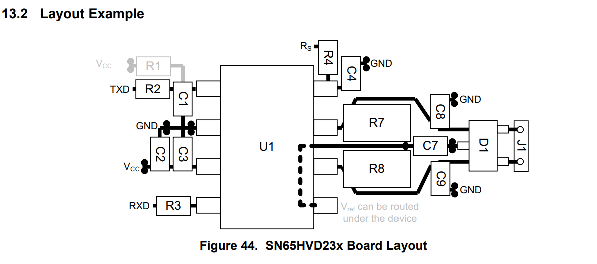
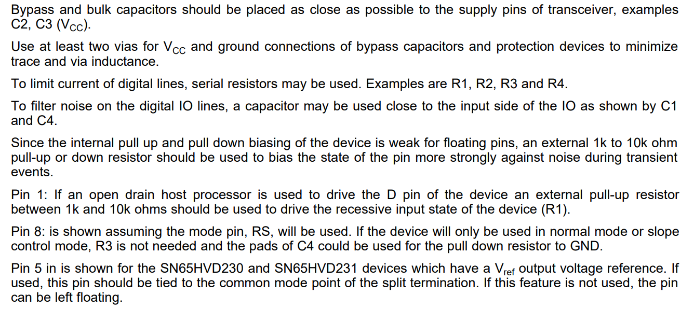
For this, I'm using an SN65HVD230DR CAN transceiver IC, and I'm essentially replicating the circuit shown above. I'll be adding multiple headers and the end-termination network directly on this board so I don't have to worry about that later. I've also been adding ESD protection to all my components, but most of them are closer to the MCU, so I'll cover that in a later journal. Here, I've added an ESD chip near the connectors, since that's where any surge should be stopped. It took a while and several iterations to figure out the end-termination placement, but this is the finished circuit.

Also, on this board I'm not using standard pin headers, except for the Raspberry Pi UART connection. I need secure, reliable connectors, so I've been using JST connectors. For these headers I've used JST-GH connectors.

**Total time spent: 3 hours**

# 2026-06-26: Stage 1 — Custom STM32F446-Based Motor Controller (Dev Board) - DEVLOG10 - I2C BUS

This is a short one. I've added some I2C connectors just to add support for any sensors I might add in the future, since it doesn't cost much. Many sensors on the market run on I2C, so having a few connectors for that just makes my board a bit more flexible.

Again, I've used JST-GH connectors, with an SM12OC ESD chip placed near them. The pinout for these connectors is VCC-GND-SDA-SCL. Most of my time in these devlogs is spent finding the right components on JLCPCB. Like with the power circuitry, I just couldn't find the right parts: some capacitors had bad derating, some inductors weren't good enough. Another big time consumer is reading through datasheets only to find out the part doesn't actually fit my needs. But with this done, I'm approaching the final stages of the schematics.

**Total time spent: 1 hour**

# 2026-06-26: Stage 1 — Custom STM32F446-Based Motor Controller (Dev Board) - DEVLOG11 - MCU ESSENTIALS

This devlog covers components and connections essential to the MCU.
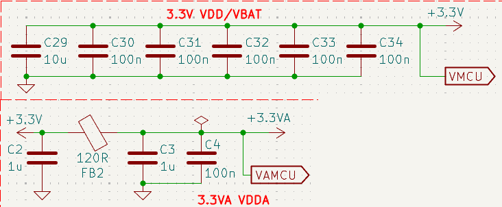
These are the decoupling rails for 3.3V and 3.3V analog (VDDA). This follows ST's documentation: one 100nF capacitor per VDD/VBAT pin, plus one bulk decoupling capacitor. The same applies to VDDA, but with an additional bulk capacitor for extra filtering and a ferrite bead connecting the two 3.3V lines.
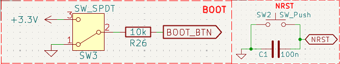
These are the schematics for the NRST and BOOT button. The BOOT button is a slider switch, and NRST is a push button. NRST already has an internal pull-up, so no external one is required.
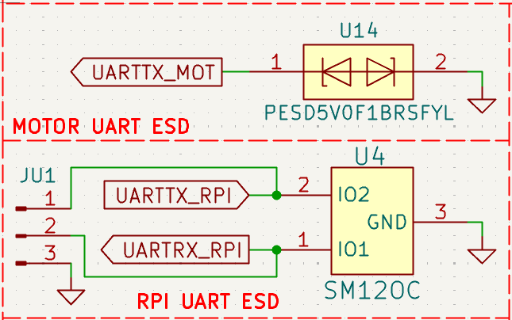
These are the MCU's ESD/UART connections. An ESD chip is placed near the MCU for the UART line going to the drivers, and another ESD chip is placed near the three-pin header for the UART connection to the Raspberry Pi.
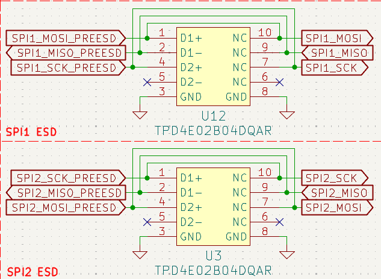
These are the connections for the near-MCU ESD chip covering the encoders' and motor drivers' SPI lines.
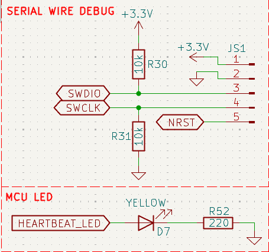
These are the serial wire debug and heartbeat LED connections. For serial wire debug I'll be using an ST-Link, so there are five pins for that.
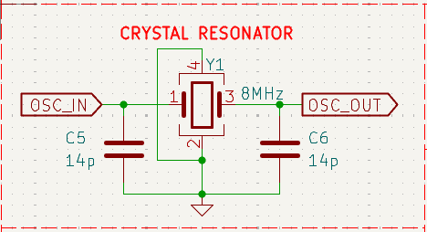
This is the crystal resonator, also mentioned in devlog 2. I've just used global labels here to keep it neater.

**Total time spent: 2 hours**

# 2026-06-27: Stage 1 — Custom STM32F446-Based Motor Controller (Dev Board) - DEVLOG12 - MCU SETUP

I've finished wiring up the MCU as well, with all the labels established and connected, and I did some cleaning up and arranging the components, overall making the schematics neat. A couple of series resistors are used on lines where current limiting is required. VCAP has a 4.7µF capacitor tied to it, as per ST's guidance. I've transferred this schematic layout from STM32CubeMX.

This is the STM32CubeMX pin layout. The CubeMX report is available in [\Stage1 - STM\CubeMX](https://github.com/atharvach2007/arsenal/blob/main/Stage1%20-%20STM/CubeMX), along with the IOC file in the same folder. All of the schematics are available in [\Stage1 - STM\voxboard](https://github.com/atharvach2007/arsenal/tree/main/Stage1%20-%20STM/voxboard).
With this, I've completed the schematics for the 6-DOF ARSENAL arm. Next, I'll move on to routing the PCB.

**Total time spent: 1 hour**

# 2026-07-20: Stage 1 — Custom STM32F446-Based Motor Controller (Dev Board) - DEVLOG13 - ROUTING #1 SETUP 

With the schematics completed, I moved on to routing. Before getting into it properly, I took a short break to work on some other projects. Once I got back to it, the first step was creating a rough layout, since this board has a large number of connectors and connection types, along with two entirely separate power rails. To manage this, I split the layout into two sections: one containing all the 3.3V components and the other containing all the 24V components. I went through three main layout iterations, with my primary concern throughout being the power circuitry. Since I estimated a maximum current draw of around 13A, I wanted to make sure the routing could comfortably handle that load without issues.

I started by placing the core MCU components: the decoupling capacitors, the crystal oscillator, and the rest of the essential MCU circuitry, including the ESD protection ICs, which I had planned to place close to the MCU, as well as the resistors for the SPI CS lines. From there, I grouped the remaining sections of the board by function, bringing the I2C connectors together, the SPI encoder connectors together, and the CAN bus connectors together along with their supporting circuitry.

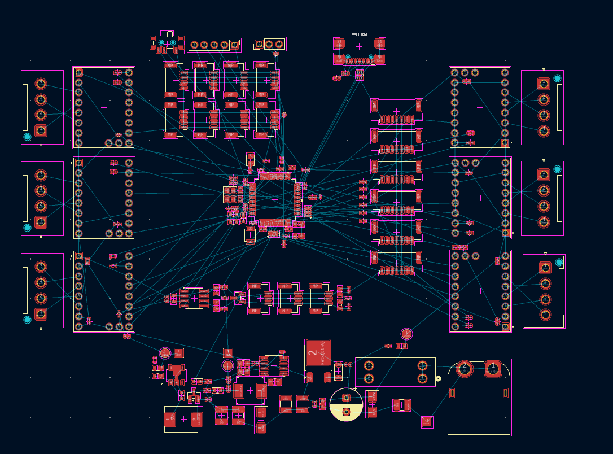
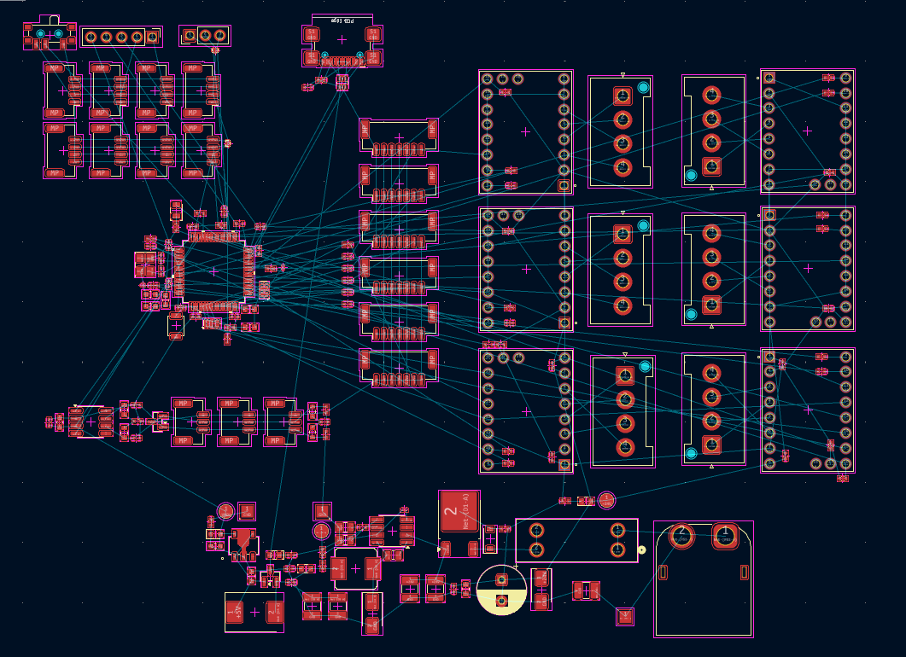
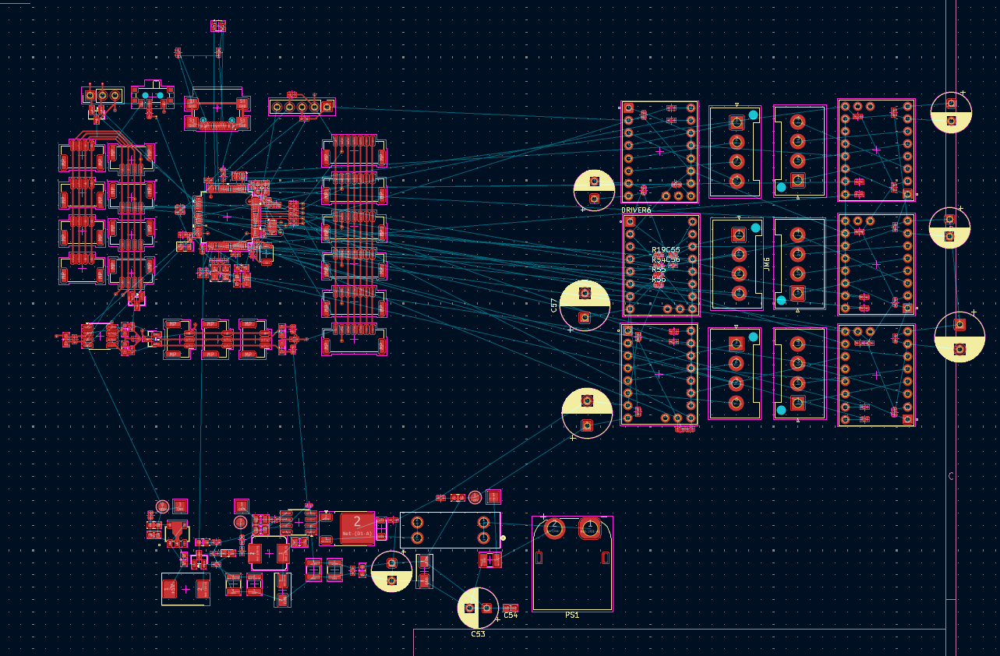

In layout 3, you'll notice six new electrolytic capacitors. I added these afterward to help suppress stepper motor noise that could otherwise leak into the logic rails, which would cause problems downstream. For now, I'm planning to move forward with this third layout as my base. The power circuitry has also been arranged temporarily at this stage, and I'll continue refining it as the design progresses.

An important note, my board has a 4 layer stackup of SIG - GND - POW (3.3V) - SIG.

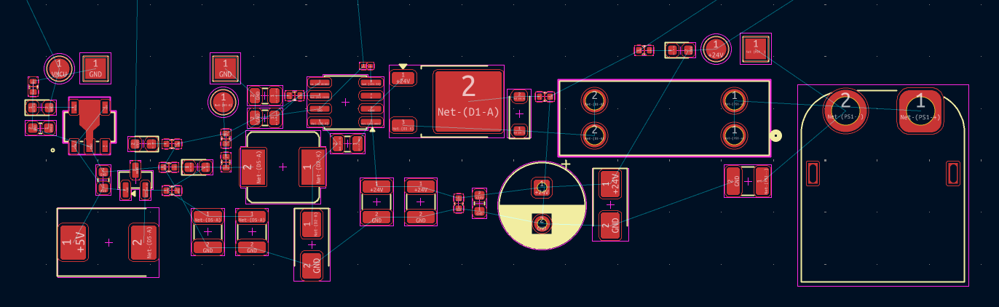

With the basic layout in place, the next step is routing the MCU and its direct connections first.

**Total time spent: 3 hours**

# 2026-07-21: Stage 1 — Custom STM32F446-Based Motor Controller (Dev Board) - DEVLOG14 - ROUTING #2 SIMPLE LOGIC CONNECTIONS 

After the rough placement, I routed the core MCU components: the power pin decoupling capacitors, the analog 3.3V connections, the crystal oscillator, series resistors on some of the I2C and SPI CS lines, the ESD protection ICs for the SPI lines, and the heartbeat LED. This layout isn't final and will likely change as the design progresses. One thing I'm considering is moving the NRST button, boot button, and heartbeat LED closer to the board boundary, both for easier access and to reduce crowding around the MCU. I'm using vias mainly for the 3.3V and GND connections, and reserving the back copper layer for the motor driver circuitry further out on the board.

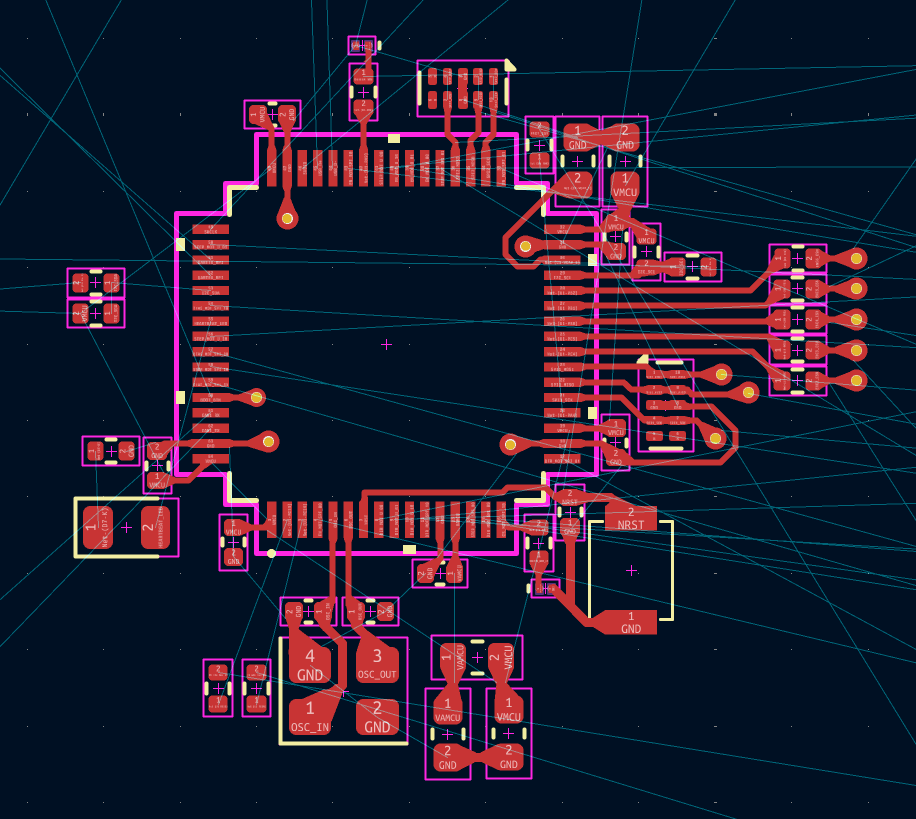

Next was the USB-C connector, which involved differential pairs and needed a bit more care. I kept the traces as short and straight as possible and placed the ESD chip right over the main differential pair. The remaining connections around it were fairly straightforward.

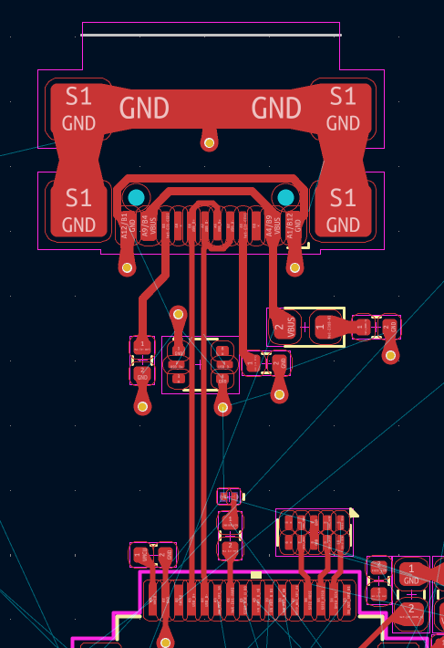

After that came the simpler connector routing for the encoder SPI and I2C ports.

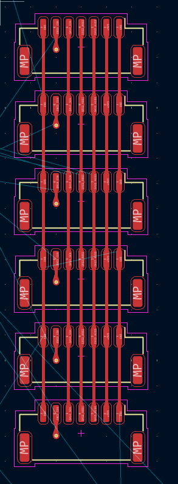
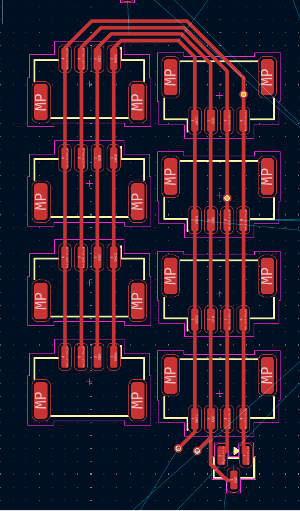

The next major piece was the CAN bus, which is mainly there to serve as a connector for the end effector. Routing itself was fairly easy, though the main challenge was fitting everything into a fairly compact area.

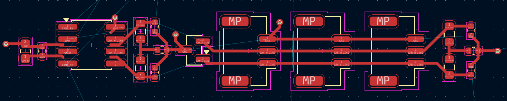

With the basic routing done, I'll move on to the power lines next.

**Total time spent: 4 hours**

# 2026-07-23: Stage 1 — Custom STM32F446-Based Motor Controller (Dev Board) - DEVLOG15 - ROUTING #3 POWER CONNECTIONS - 1 

My main concern at this stage was figuring out how to carry such high current across the board while keeping the motor current properly isolated from the logic current. I started by laying down thick traces capable of handling the 13A requirement I'd estimated earlier.

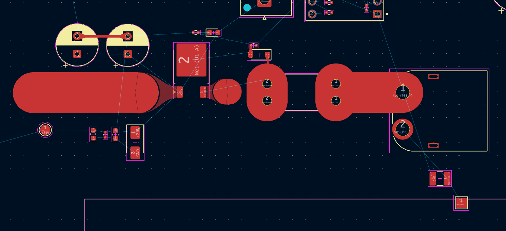
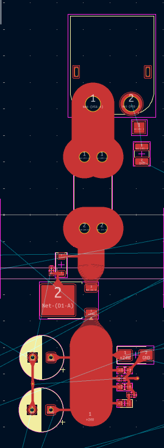

This does look a bit messy, but I couldn't really come up with a cleaner approach given the constraints. Next, I moved on to wiring up the smaller components for the buck converter and the LDO, trying to keep the whole configuration as compact as possible. This ended up being the most time consuming part of the whole process. I spent hours re-iterating on the layout, shrinking it down bit by bit each time I found a slightly better arrangement.

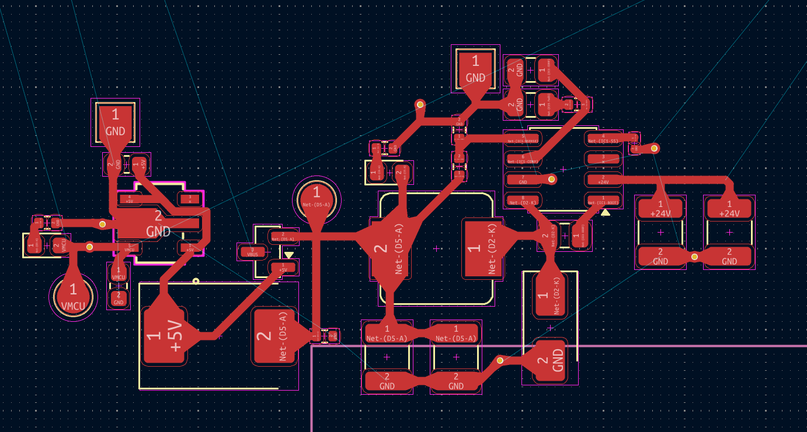

Along the way, I also revised the motor driver layout. I decided to run the entire power rail between the rows of drivers, so that the 24V side stays isolated on one side of the board while the 3.3V connections can travel across to the other side using the third power layer.

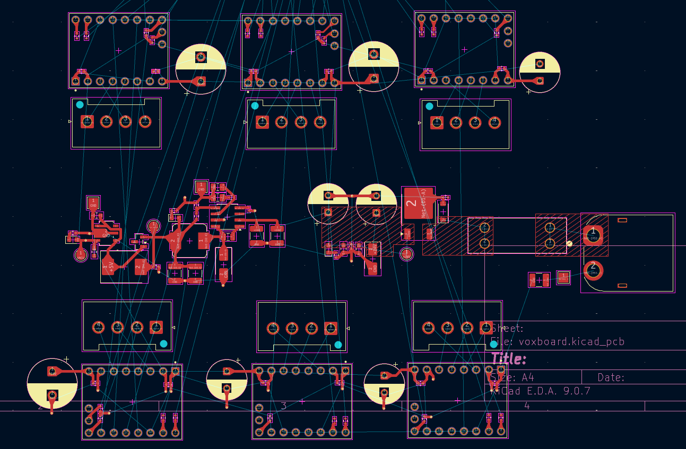

The bigger challenge after that was figuring out how to extend traces out to the 24V inputs of each driver from the central thick trace. After a fair bit of trial and error, I landed on a spider-like branching structure that seemed to work well. Part of the difficulty here was that this isn't the only set of traces converging near the drivers, so I had to leave enough room to account for the other connections that would eventually need to pass through the same area.

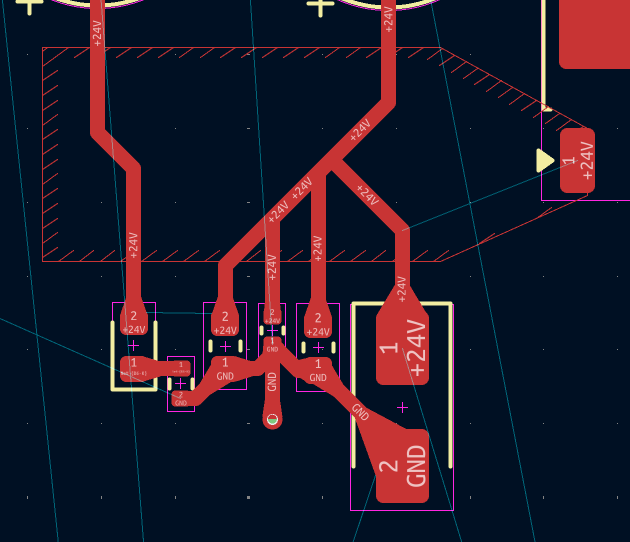
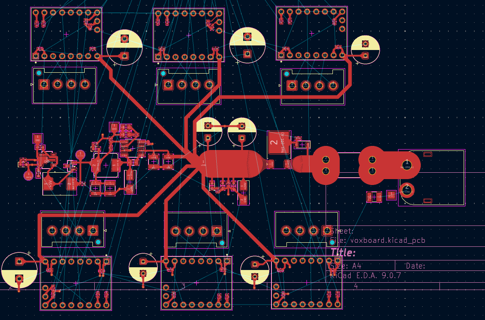

With the power routing mostly done for now, I'll probably move on to the remaining connections next, but I might revisit this tomorrow.

**Total time spent: 5 hours**

# 2026-07-24: Stage 1 — Custom STM32F446-Based Motor Controller (Dev Board) - DEVLOG16 - ROUTING #4 POWER CONNECTIONS - 2 

After sharing this setup with a few friends on Slack and getting laughed at over the spider structure I made, they suggested I switch to using fill zones instead. Since a fill zone would handle the current distribution far more cleanly than a tangle of individually routed traces. So my plan going forward is to build a fill zone shaped like a tree across the top layer, since 1oz copper will be used for the top layer, and leave the third layer reserved for the 3.3V connections.
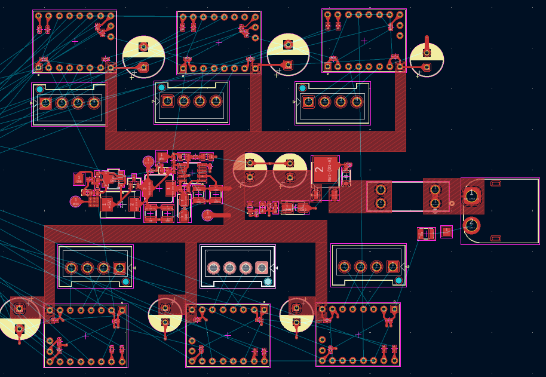
With that done, I'm quite satisfied with how it turned out, though I still think there's room to make the overall design more compact. So I will be spending some more time on that front as well, mostly just shifting components around and tightening up the spacing wherever possible. I won't be documenting every small shift here, but I'll include the final result in my closing devlog for this board.
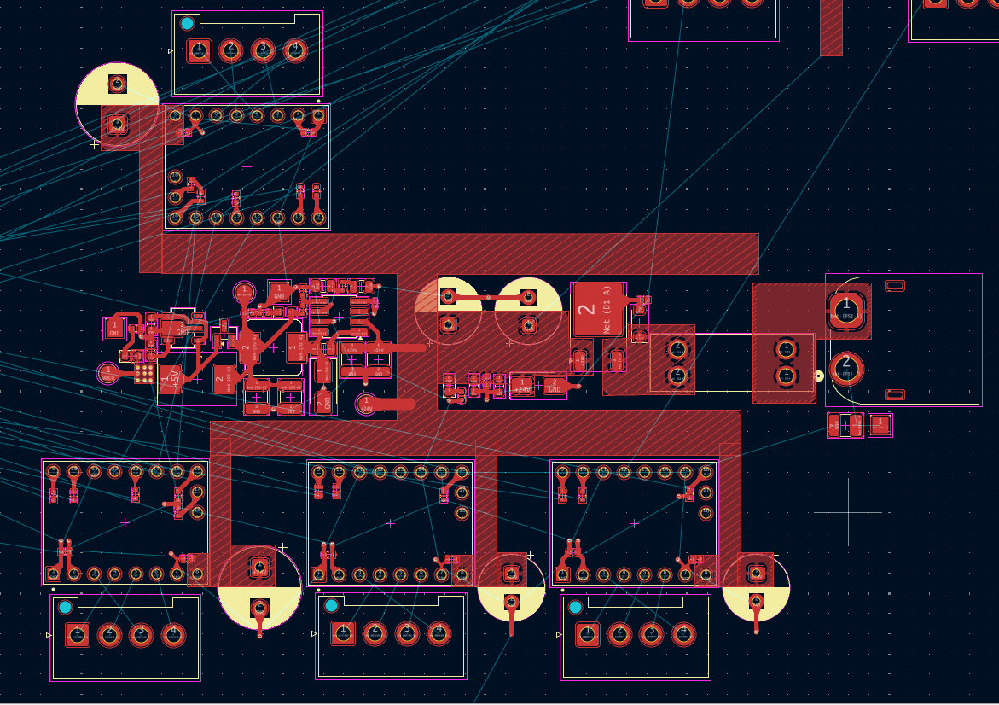

**Total time spent: 2 hours**

# 2026-07-27 to 2026-08-24: Stage 1 — Custom STM32F446-Based Motor Controller (Dev Board) - DEVLOG17 - ROUTING #5 OVERALL CONNECTIONS - 1

I stopped working on this project consistently once school started, so I only managed to squeeze in small bits of progress whenever I found some spare time. Because of that, this stretch isn't documented nearly as well as my other journals. So instead of trying to create a set of day-by-day journals, I'll be combining all of these smaller bits and posting 4 long journals covering everything I worked on over this month-long tenure. This was also my first time building a devboard this complex, so things took a lot longer than they should have, but I learned quite a lot in the process.

So, once the main power rail was done, which basically involved wiring the input into a small filtering network with back-EMF protection, this now reasonably clean 24V input was fed into the motors. The same input was also tapped off into a buck converter, producing a 5V/3A output, which then feeds into an LDO to finally produce a stable 3.3V/1A rail for the logic side.

With that settled, the main routing left was connecting the MCU to the rest of the board. To start off, I routed the connections to the nearby I2C and CAN connectors, which were pretty straightforward and didn't need much thought. Next up was the CSN lines going to the encoder SPI connectors, which had to pass through series resistors placed close to the MCU to keep the signal integrity reasonable.
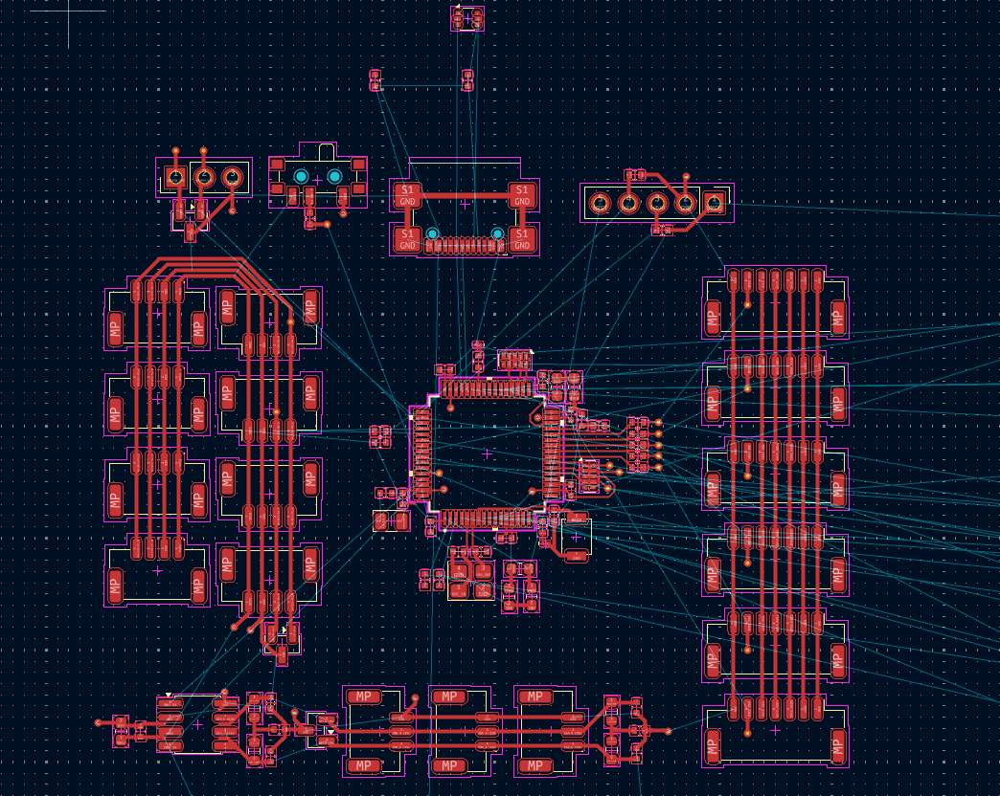
Speaking of placement near the MCU, let me elaborate a bit on my ESD protection plan, since it's something I put a fair bit of thought into. Basically, I have two different placement strategies depending on the type of connection. Connectors that go off-board to the outside world, things like USB-C, CAN, RPi UART, and I2C, get their ESD protection placed right at the connector itself. That's because that's exactly where a static discharge or a cable-insertion transient would actually enter the board, and stopping it right there means it never gets the chance to couple onto anything else further downstream. On the other hand, buses that stay entirely internal to the board, like SPI1 going to the encoders, SPI2 going to the TMC5160 drivers, and the TMC2209 UART buses, don't really have an external entry point in the same sense, so their ESD protection sits near the MCU instead, guarding the chip's pins directly on a shared bus trunk that feeds several onboard devices at once.
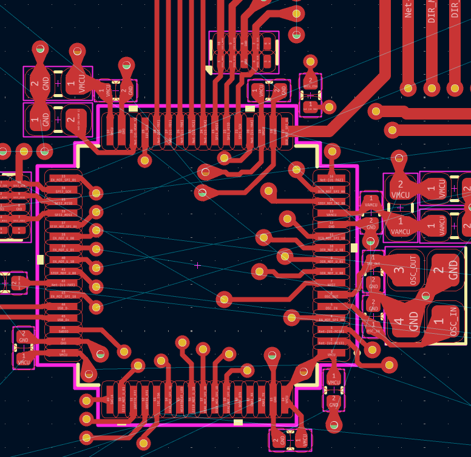
**Total time spent: 7 hours**

# 2026-07-27 to 2026-08-24: Stage 1 — Custom STM32F446-Based Motor Controller (Dev Board) - DEVLOG18 - ROUTING #6 OVERALL CONNECTIONS - 2

Now onto the actual routing grind. Once these peripherals were in place, the board very quickly started getting cluttered, a lot more than I expected. I kept running into situations where I simply couldn't route something because there was always some other trace or component blocking the path. So after a round of very tedious rearrangements, things slowly started coming together, though it definitely wasn't smooth.

As I started routing the connections to the motor drivers, specifically the DIR and STEP pins, it became difficult getting traces across to the other side of the board. This is where I made a fairly big mistake early on: I ended up routing the logic traces before the signal traces, which meant that by the time I got to the signal traces, they had become a nightmare to manage since all the easy paths were already taken.
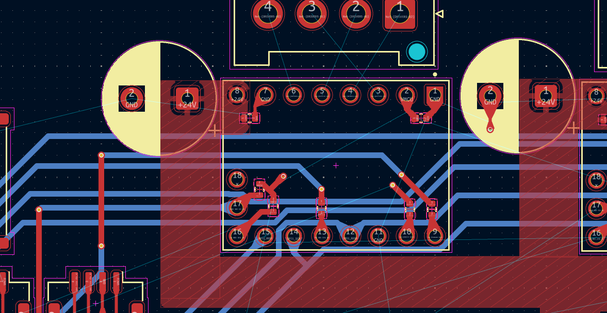

Another problem that came up was that my initial component placement had the encoder connectors sitting right between the MCU and the drivers, which wasn't ideal. So I had to remove the existing connections entirely and rework the placement. Since I wanted to keep the board as compact as possible, this meant making a few changes, the main one being folding the CAN bus layout so that the transceiver IC now sits vertically above the connectors instead of alongside them. The new layout ended up with USB on the left, along with the serial wire and RPi UART, encoders on top, and I2C on the side. This arrangement conveniently leaves the bottom layer almost completely free of traces, since the I2C connectors only need the top layer here, with the CAN bus sitting at the bottom of the board.
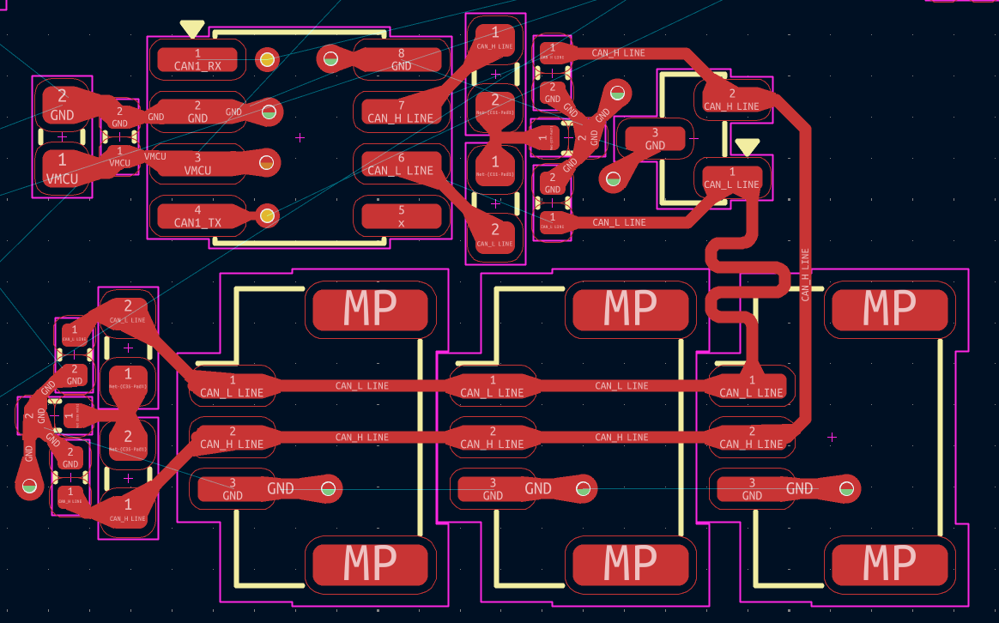
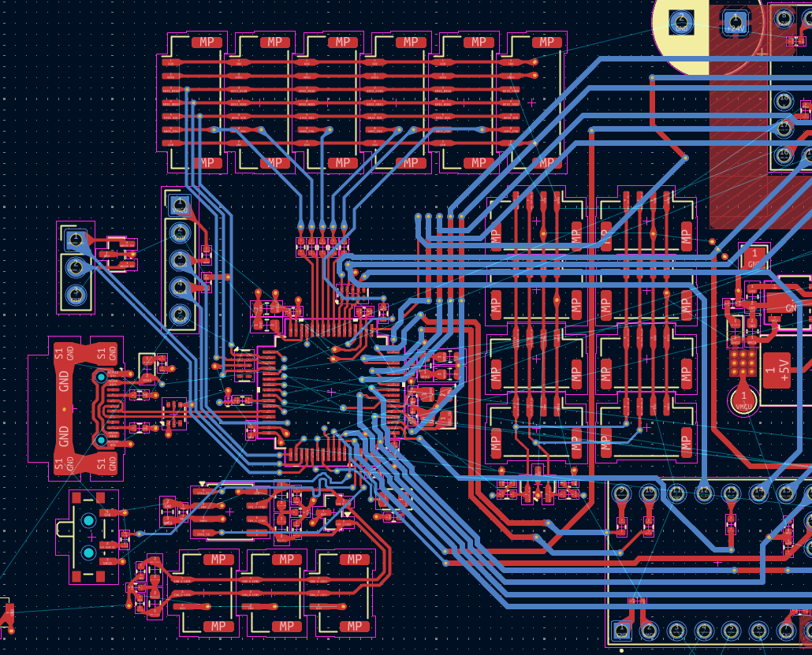
From there, I started routing all the different logic connections to the drivers, leaving the signal connections for last since I knew those would need more careful handling. A lot of problems came up here, mainly around figuring out how to route everything to where it actually needed to go. A recurring issue was pins conflicting with each other, like two adjacent pins that both needed to travel toward each other, creating a barrier between them. These small problems ended up eating a surprising amount of time individually.
But after wrestling with this for a long time, most of the main routing was finally done. I then moved on to the signal lines, which, after a lot of back and forth and liberal use of vias to hop between layers, were also eventually finished.
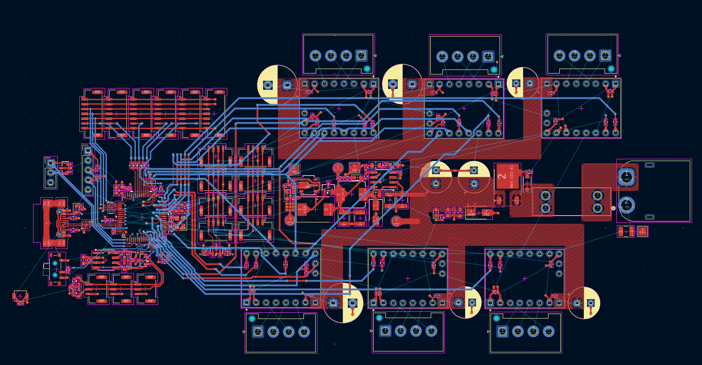

**Total time spent: 7 hours**

# 2026-07-27 to 2026-08-24: Stage 1 — Custom STM32F446-Based Motor Controller (Dev Board) - DEVLOG19 - ROUTING #6 OVERALL CONNECTIONS - 3

At this point, a new problem arrived: a handful of pins on the MCU had ended up boxed in, meaning I couldn't route them out on either layer since they were completely surrounded by other traces on all sides. To fix this, I had to REROUTE for the 3rd time.
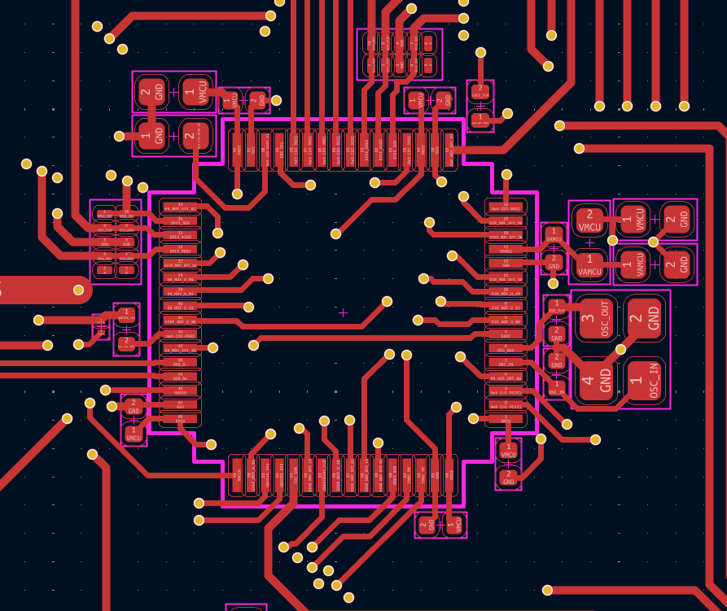
Once this round of rerouting was done, I posted my design in a friend's Slack channel to get some feedback, and basically got met with horror. Well atleast I got some advice. The first was that I should be placing ground vias around any vias carrying high-speed signals, a method known as via stitching. The idea is that it gives the return current a short, direct path to follow alongside the signal instead of forcing it to detour around the board, which keeps inductance low and helps avoid EMI issues down the line. The second, related concept was via fencing, which is essentially the same idea scaled up: a full ring of ground vias placed around a wider area for broader shielding, rather than just single vias next to individual signals. So I went through and added around 2 ground vias per signal via, and things were looking good after that.
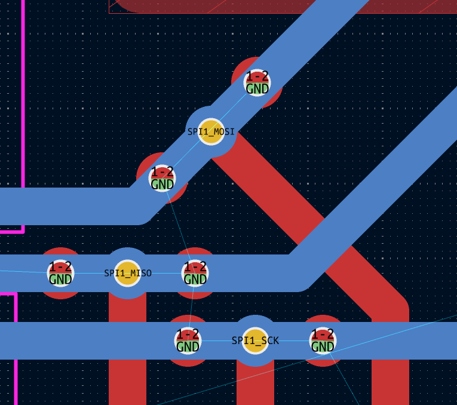
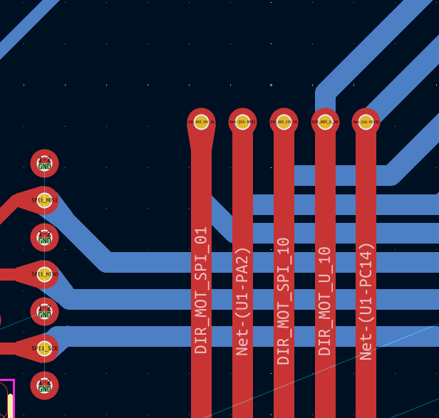
I then moved on to creating the pours for my 3.3V layer, basically laying down a bunch of layer fills exactly where I wanted the pours to sit, and at this point I thought I was done. I created the ground fill as well, set up the board boundaries, and everything seemed finished and tidy.

That is, until someone on Slack pointed out that my vias had "1-2" or "1-3" written on them instead of going all the way through. Basically, I had assumed early on that vias connecting to the ground plane or the 3.3V plane didn't need to go all the way through the board, thinking this would save some routing area on the bottom layer. So, without fully realizing it, I had ended up using microvias for essentially everything. Every single via on the board turned out to be a microvia.

I tried using the "edit via properties" option to fix this in one go, but that didn't work the way I expected, and all of my vias remained stubbornly micro. Somehow I had ended up with microvias set to custom dimensions I had defined myself, so when I ran edit via properties, every single one of them got reset to the default netclass dimensions for microvias instead, which only made the mess worse. In the end, I had to delete each via individually and manually add normal through-hole vias in their place. While I was at it, I checked JLCPCB's manufacturing specs and found 0.4/0.3mm to be the smallest "free" via size they could reliably produce, so I standardized every via on the board to that size going forward.
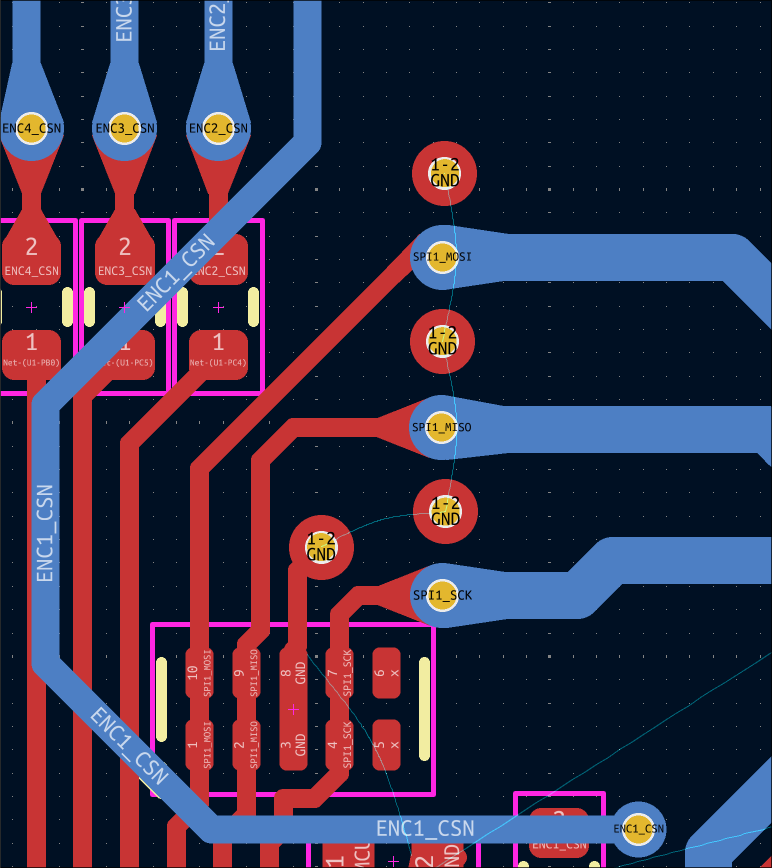
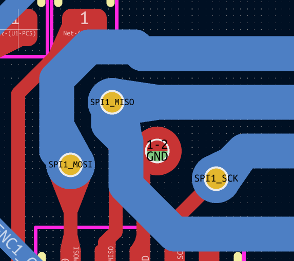

**Total time spent: 7 hours**

# 2026-07-27 to 2026-08-24: Stage 1 — Custom STM32F446-Based Motor Controller (Dev Board) - DEVLOG20 - ROUTING #7 OVERALL CONNECTIONS - 4

The via change, of course, gave rise to a fresh set of problems. The updated via sizes and clearances made my 3.3V pour discontinuous, since all vias were now punching all the way through the board instead of stopping partway. I had to go back and reconfigure the placement of both the vias and the pours to restore continuity. On top of that, a lot of these newly resized vias now sat directly over traces on the bottom layer, so a majority of those traces had to be REROUTED, for the 4th time. This time, I made sure to double-check clearances, via sizes, and track sizes across the entire board, and I di believe I was done.
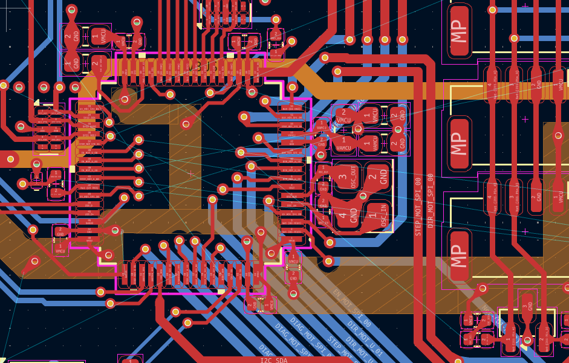
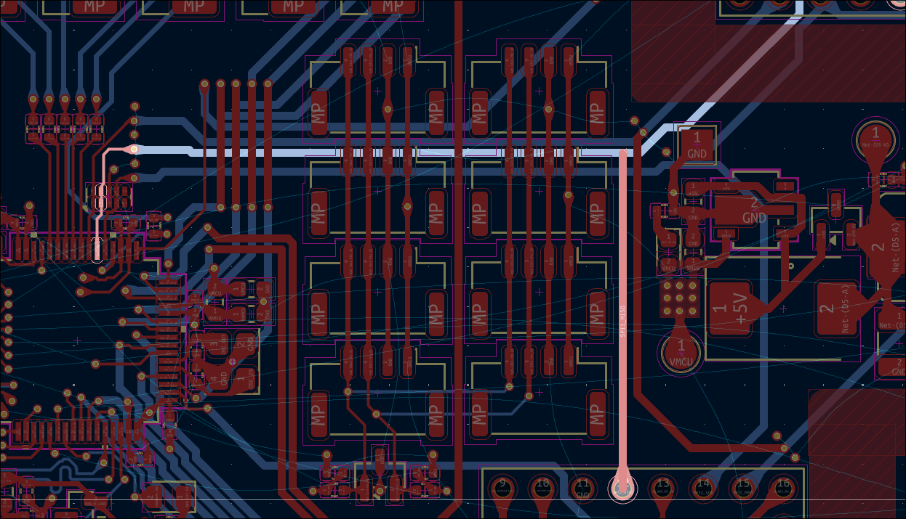
Then someone then brought up return paths, which tied directly back into the via stitching discussion from earlier. They pointed out that signals like UART and SPI shouldn't be routed directly over the power pours I had created on layer 3, since doing so disrupts the return current path. My routing had a good number of signal traces crossing right over that pour. So I had to reroute these signal traces yet again, this time by bringing them up to the top layer and shuffling other components and traces around to make room. By this point, a substantial amount of routing had already been completed, and to free up the necessary space, I ended up having to delete most of it, again.

This time, though, it really was the final rerouting. After spending a few more days tidying up and polishing the board, I redrew the board boundary, merged all the separate fill zones belonging to the same nets, and also discovered that the terminals on my XT60 connector symbol were reversed, which I fixed. I added a few extra decoupling capacitors near the negative terminal, removed the ferrite bead I'd initially placed, and made a handful of other small cleanup changes, and with that, I was done. Period.

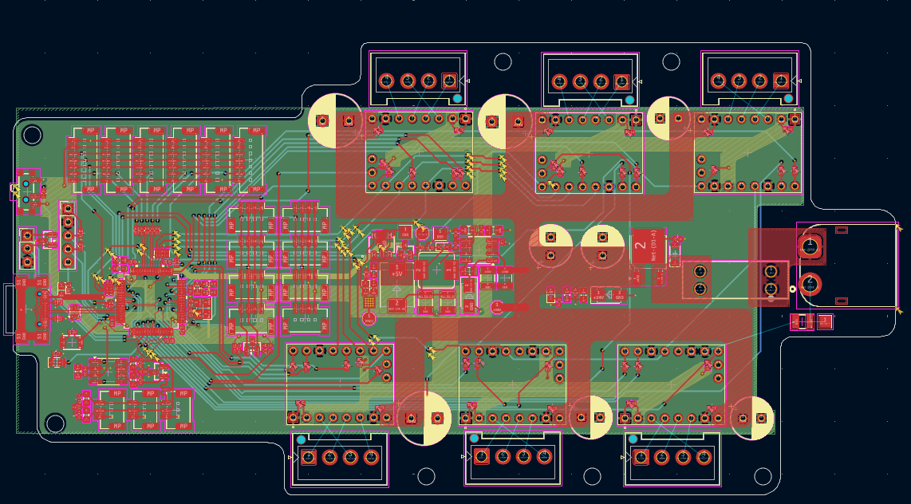
From there, I moved on to adding all the missing 3D models in KiCad. I couldn't track down an existing 3D model for the inductor, so I ended up modeling one myself in Fusion 360. The motor drivers didn't have models available either, so I made those from scratch as well, complete with connector slots to match the real footprints. I also swapped out the JST connectors I had originally used for the motors in favor of JST-XH ones instead, for a more secure and standard connection.

With all of that wrapped up, I added some silkscreen details: a short note explaining what the board is, my personal hallmark and logo, and a couple of other fun little touches. I then tidied up the schematic sheet, filled in a few remaining details, and with that, VoxBoard V1 was officially done.
Here are the Results.

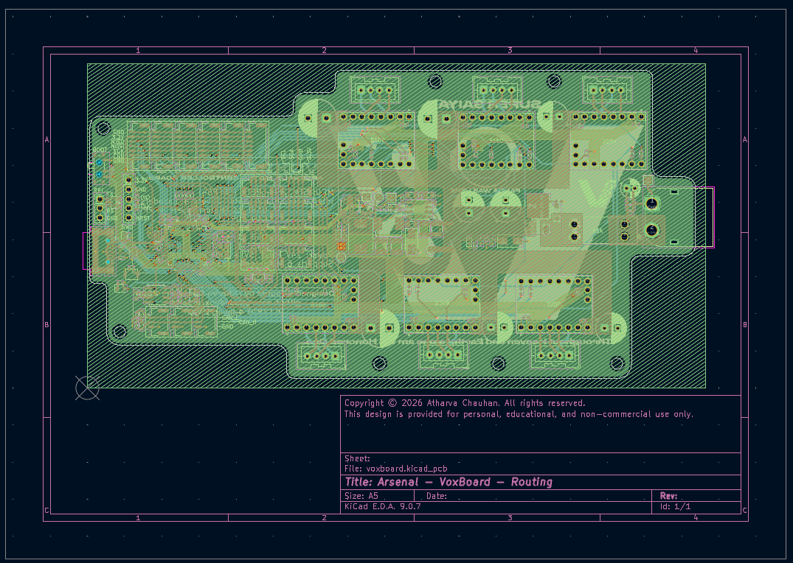
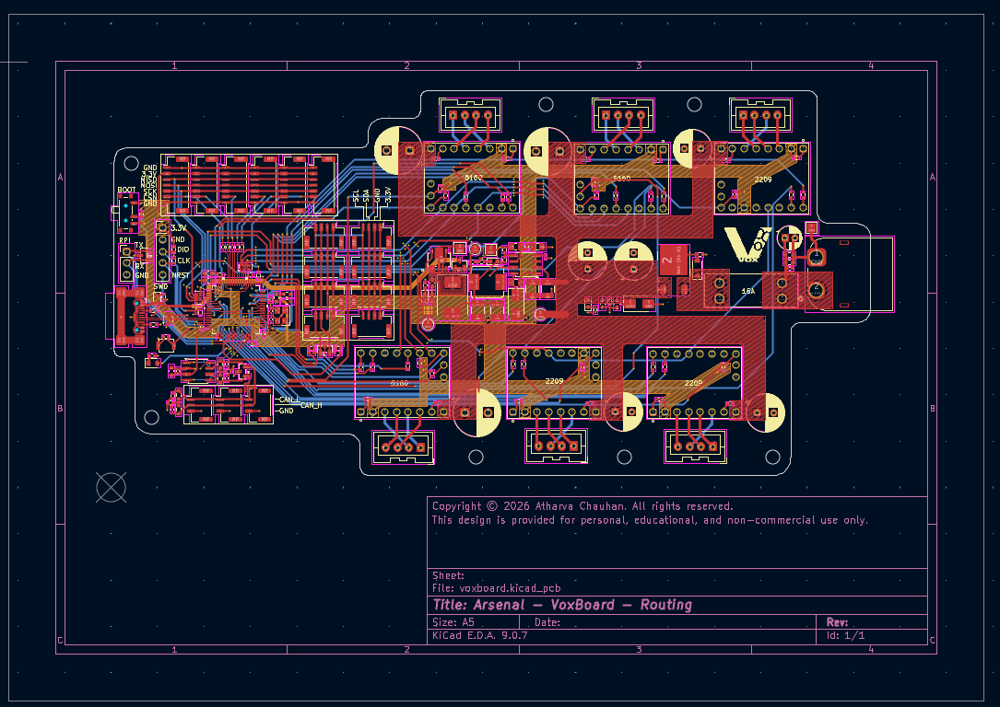
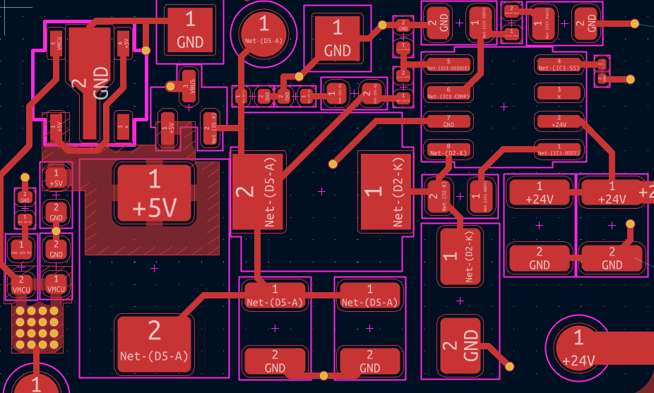
This was the final compressed layout of the power circuitry.
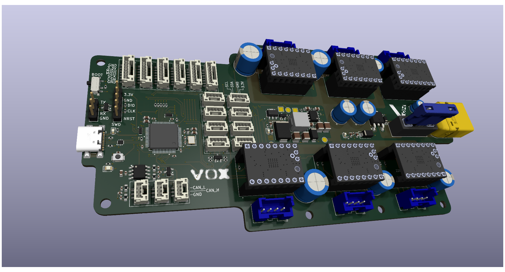
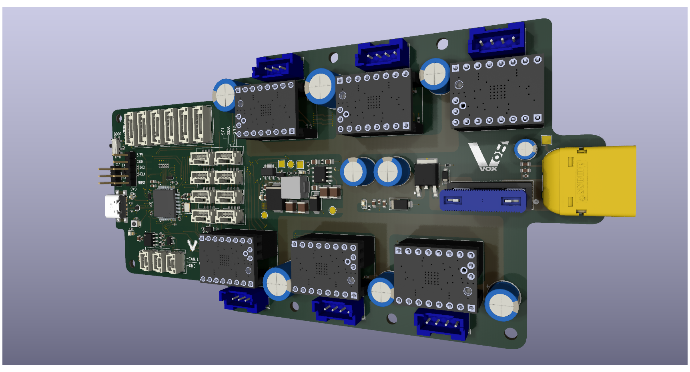
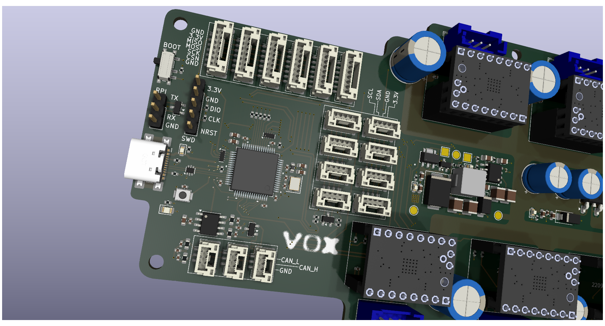
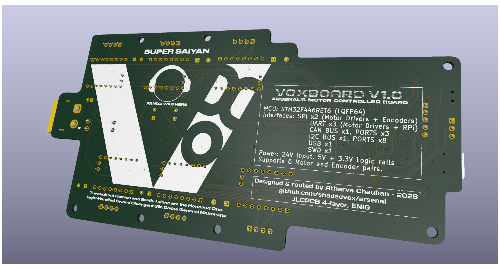
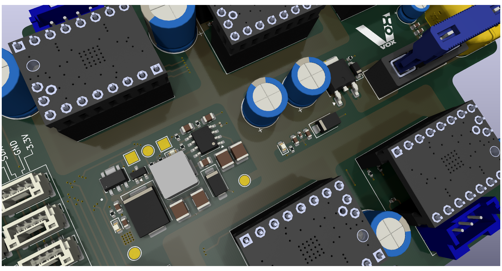
It's beautiful.

**Total time spent: 7 hours**

# 2026-10-01: Stage 1 — Custom STM32F446-Based Motor Controller (Dev Board) - DEVLOG21 - BOM

So I exported the BOM from KiCad through the fabrication tool and then sat down to find all the JLC part numbers for these parts. While doing that, I had to change some of the footprints, since I'm not sure why exactly I chose those footprints when they didn't have parts available in that size or form. There were some major changes that involved rearranging some parts on the power rail, but it wasn't a big deal and got resolved easily.

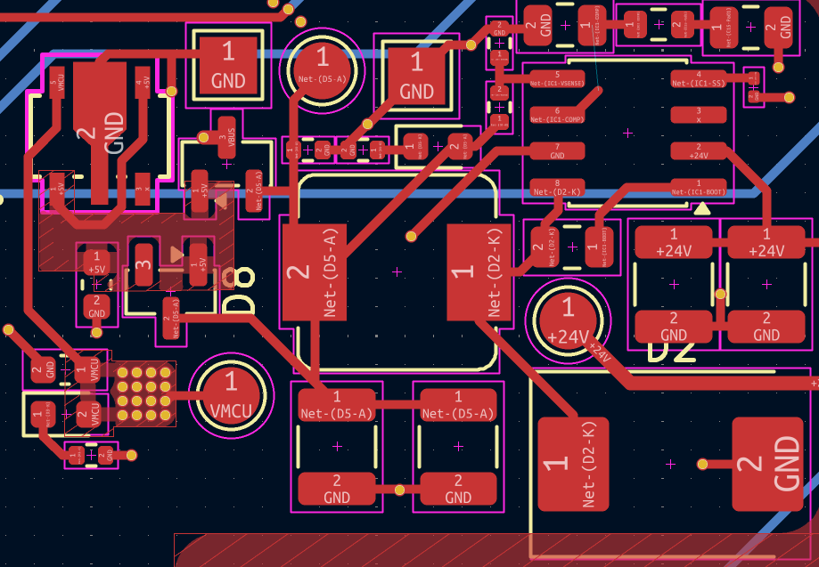
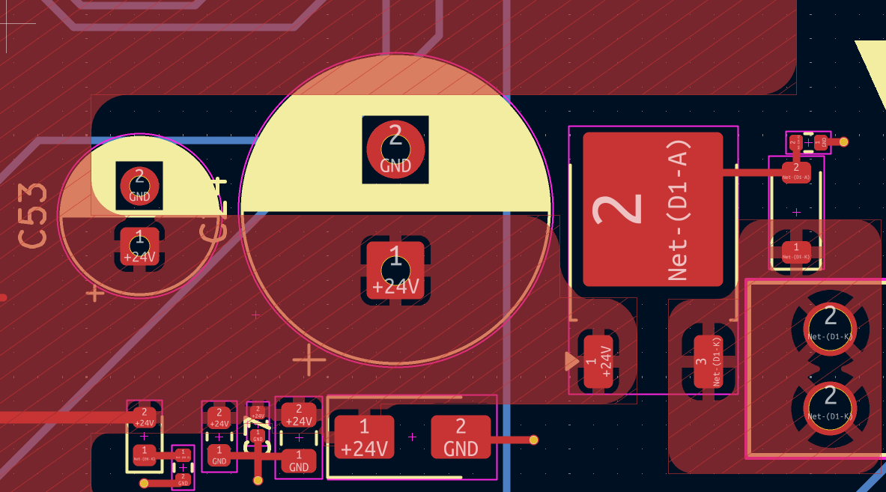

So, after these small changes, uploading the BOM to JLC and finalizing my parts cart was done. The BOM is present in [\Stage1 - STM](https://github.com/shadedvox/arsenal/tree/main/Stage1%20-%20STM). The parts total, as of October 2026, comes out to $63.61 for 2 PCBAs. This is only the parts total; the PCBA and PCB manufacturing charges still need to be calculated.

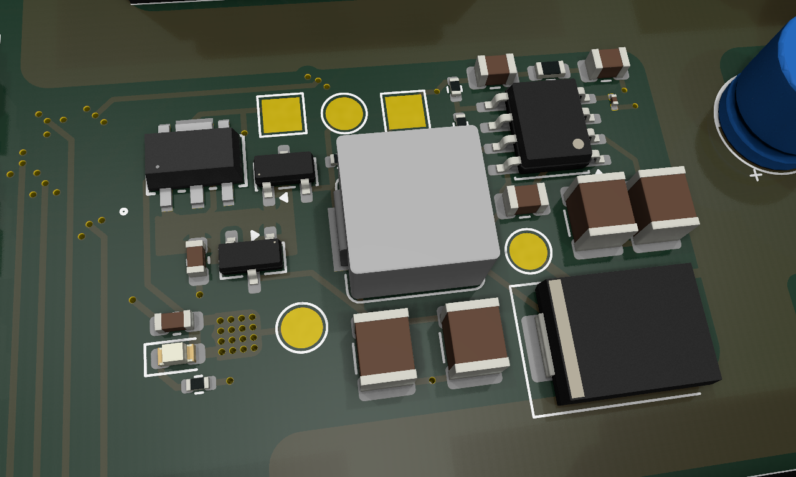


**Total time spent: 2 hours**

# 2026-10-03: Stage 1 — Custom STM32F446-Based Motor Controller (Dev Board) - DEVLOG22 - GND POURS, VIA STITCHING

This journal entry is mainly to commemorate my stupidity: I spent two hours placing via stitching patterns manually, completely unaware that plugins exist to do it automatically. That's all—I manually placed via stitches all over the board after creating GND pours on both signal layers.


This is the final showcase of Voxboard V1.


**Total time spent: 2 hours**