# 2026-05-29: Stage 1 — Custom STM32F446-Based Motor Controller (Dev Board) - DEVLOG1 - RESEARCH

This is my first journal entry for this project. I'm fairly new to dev board designing for STM32, so I needed to get familiar with the MCU itself. It turned out to be quite complicated, but I found resources that made it simpler. First I needed to figure out how my dev board is going to work, basically what goes where and how it all connects.

My board needs an MCU of course, along with all the components needed to support it, then four NEMA 17 motors and their drivers. These four motors will be of different torque ratings: the elbow needs to be the highest rated NEMA 17, while the yaw needs to be the lowest, though this will ultimately be based on availability. Along with these, for the base and shoulder I need two NEMA 23 motors and their TMC5160 drivers. All the motors will have magnetic encoders on them so I can track their rotation accurately. So my board will have two UART connections for the four TMC2209 drivers (NEMA 17), with one UART split for two drivers, and one SPI connection for the two TMC5160 drivers (NEMA 23). The six encoders will also share one SPI connection, and the third SPI will be left open, I might add a display later, though it isn't needed at this stage. I've also been thinking about adding an ESP32 chip, mainly for the combined Wi-Fi, Bluetooth, and especially ESP-NOW, since I could potentially make a controller using joysticks, a screen, and an ESP32 to control the arm myself. I'm still figuring some stuff out for this, since I could make a separate ESP board entirely for wireless connections and hook that up over UART to the Raspberry Pi. I'll figure this out soon. After this research phase, four hours which I forgot to log at the time, I started watching a video on STM32 design by Phil's Lab, which was genuinely helpful. After the schematics part was done, I started reading the application notes for power and USB, and the F446RE datasheet.
The research is hopefully done for now, onto making the schematics.
This reading was recorded via timelapse here: https://lapse.hackclub.com/timelapse/VTKueXd4oU-n

**Total time spent: 6 hours**

# 2026-06-07: Stage 1 — Custom STM32F446-Based Motor Controller (Dev Board) - DEVLOG2 - BASE SCHEMATICS

After the last journal entry I took a break for a bit, but I'm back on it now. I started working on the main schematics of the board, starting with the MCU. I connected up the MCU power grid, including the decoupling capacitors, then the clock circuit, all configured using STM32CubeMX, which is a genuinely useful tool.

This took a lot of time since I was simultaneously looking up niche or specific parts on the JLCPCB parts picker. For example, finding my crystal resonator took a while since JLCPCB now refers to crystal resonators simply as "crystals." My clock configuration on the STM32 chip also wasn't auto calculating correctly, and my HCLK, the chip's clock speed, was capped at 16MHz when it can go up to 180MHz. This took a while to figure out since that part is supposed to be automatic, which made it hard to find solutions. After a few tweaks to the configuration, 180MHz was verified using an 8MHz resonator.

Next I'll be working on attaching a USB-C header, then creating the main 24V to 3.3V power circuit, since I plan on using external 24V power that I'll step down using an onboard buck converter. After that I'll work on the connection protocols, the UARTs and SPIs for the drivers. I'll also probably add jumper headers to most of the unconnected GPIOs so I can expand the board's capabilities later on.

**Total time spent: 5 hours**

# 2026-06-13: Stage 1 — Custom STM32F446-Based Motor Controller (Dev Board) - DEVLOG3 - POWER CIRCUITRY - 1

For power, I'm using a 24V input from an external source (wall power adapter) through the XT60 power connector. To run my MCU I had to step this down to 3.3V, or else everything goes up in smoke. For this I made my buck converter onboard, and the circuitry ended up being a lot more difficult than expected.

This is the general application circuit provided in the datasheet of the IC I'm using (TPS54331), and on the surface it looked like exactly what I needed, but it wasn't quite that simple.
This is a direct 7-28V to 3.3V converter. I could have gone with this, but it usually produces a noisy output, which isn't ideal for a stable operating MCU. So the plan is a 24V to 5V buck stage, then a 5V to 3.3V LDO. The LDO provides the stabilization needed at the output and reduces noise drastically. The issue was I had to wire the buck stage for 24V to 5V. Not a lot changes here, only the compensation network, the voltage divider resistors, and the main inductor, all derivable from formulas in the datasheet.  Sounds straightforward, and it would've been, if not for the 'incomplete' datasheet.

The biggest headache of this entire part was the compensation network, because the datasheet has no reference as to what alpha is, not written anywhere. After assuming alpha to be the gain, which turned out to be true, I found that the datasheet's own calculations for its network did not match up. It gets better: ceramic capacitors experience something called derating, where at higher temperatures and/or voltages their capacitance dips. At 5V, a lot of 10V capacitors become around 30 to 40 percent of their initial value, so a 100uF 10V ceramic becomes a 30 to 40uF capacitor, more than half the capacity lost. This was crucial for my output capacitors since they'd be the ones under load, so I had to go through the entire JLCPCB parts library for capacitors that don't derate as badly at 5V. In the end I settled on a 16V ceramic I found with manageable derating. Many datasheets also don't include the derating curve itself, which is what you need to figure out how much derating occurs at a given voltage. I switched to electrolytic capacitors midway, then needed their ESR, which again was missing from the datasheets. This was by far the most frustrating part of the project so far.

Now I have another problem. I have to wire up the USB-C 2.0 connector, and the issue is that since I have external power, I can't accept VBUS directly. What I also want is for the MCU to stay on when only USB is connected but the battery isn't. So the intended behavior is: battery only, whole system on (motors, drivers, MCU); battery plus USB, whole system on but powered by the battery, with USB used only for programming; USB only, only the MCU on for programming. My plan is to use a mux to monitor both inputs, with VBUS going through an LDO to 3.3V, and main power also at 3.3V. I'll be working on this next.

**Total time spent: 10 hours**

# 2026-06-20: Stage 1 — Custom STM32F446-Based Motor Controller (Dev Board) - DEVLOG4 - USB CIRCUITRY - 1

This is the basic connection of my USB Type-C 2.0 connector with my MCU. It has an ESD protection IC connected to the D+ and D- lines of the connector, since these are high speed USB 2.0 data lines and any ESD event would simply destroy the data.

Now addressing the issue of conflicting VBUS and 5V from the battery. I came up with a simple circuit involving a P-MOSFET, though I'm quite skeptical about how well this works. I started out with simple diode ORing, but I ran into a distinctive issue: when both inputs are connected, whichever side has the higher voltage wins and passes through. Neither of these lines is exactly 5V. VBUS especially is very fluctuating, and my buck output also wouldn't be exactly 5V, I estimate it to be anywhere between 4.8 and 4.9V. So it's possible that VBUS sometimes overpowers the 5V rail and pushes through. Since my goal is to always prioritize the buck output, I chose a PMOS circuit that always prioritizes the buck output over VBUS.

**Total time spent: 2 hours**

# 2026-06-21: Stage 1 — Custom STM32F446-Based Motor Controller (Dev Board) - DEVLOG5 - USB CIRCUITRY - 2

The first issue I addressed was that my symbol for the USB connector, which I had obtained from KiCad itself, was wrong. It was missing the double D+ and D- pins and only had a single CC pin. My guess is it was made to work in only a single orientation, which goes against the USB-C design. So I fixed that with my own symbol for a specific USB-C jack, the USB4110-GF-A.

I also swapped out my ESD chip since I looked at the footprint and it was going to be very hard to route under, as the chip was very, very small. I fixed the rest of the connections as per the new jack.
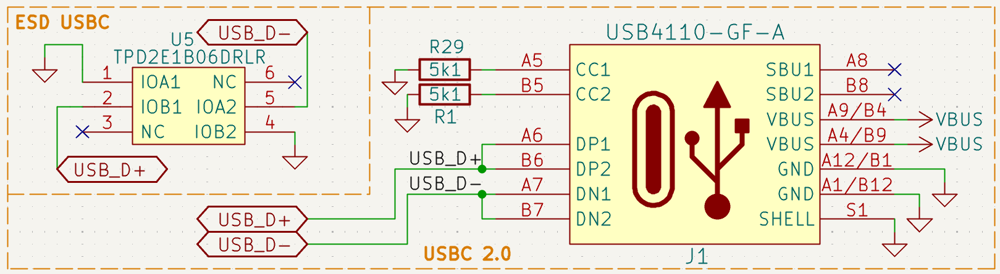
The main time consumer here was the 5V/VBUS conflict. My last circuit would not have worked, since it did not actually address my "5V buck priority" requirement at all. So in the improved circuit I added a Schottky diode across the gate and the drain. Whenever the 5V buck line is live, it slips past the diode, and since the diode connects the drain and the gate, the PMOS turns off, blocking VBUS.

I've also finalized my encoder choice for the drives to be installed. I've settled on the MT6835, a 21-bit magnetic encoder. My earlier choice was the AS5048A, a 14-bit encoder, but I could not find any marketplace where that was available in India. My latest choice is not only available on Robu, it's also higher resolution.

**Total time spent: 4 hours**

# 2026-06-22: Stage 1 — Custom STM32F446-Based Motor Controller (Dev Board) - DEVLOG6 - POWER CIRCUITRY - 2

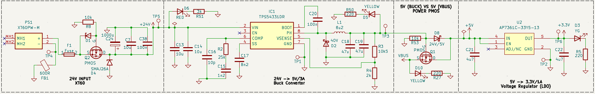
The main time consumer this time around was the problem of noise. I had done a pretty decent job of isolating noise earlier, but there were some key blind spots. My PCB, as of now, is meant to be stacked as SIG-GND-POW-SIG, and the ground plane is supposed to be a simple copper pour. This works better since the inner layers use the lighter 0.5oz copper, and having an entire copper plane helps with current distribution and gives very low resistance. This does mean the motors and the logic share the same ground, so noise from the motors travels into the ground plane.
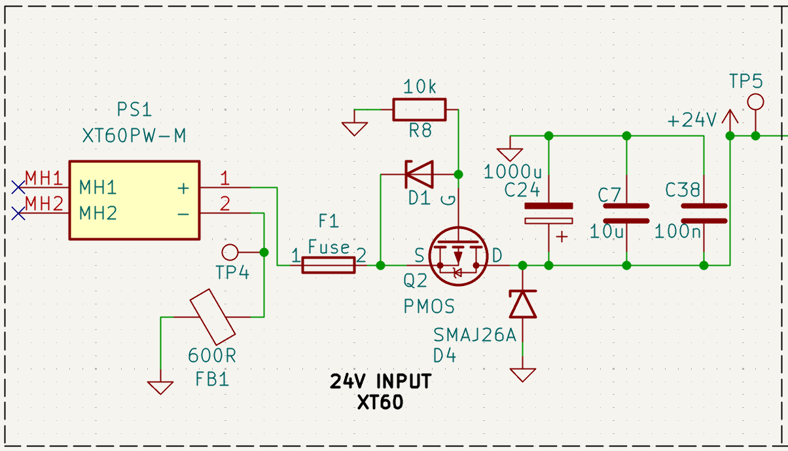
I attached 5 decoupling capacitors to the 24V rail to filter out as much of that noise as possible, covering the maximum range of frequency I could, along with bulk decoupling capacitors near the motor drivers. There is also a ferrite bead connecting the connector to the main ground plane. For now, although it isn't perfect, I'd say it's adequate. I will of course be changing some things as I route.
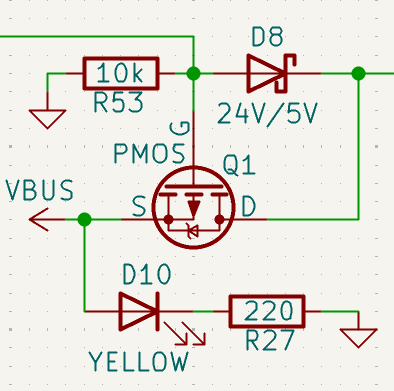
This 5V/VBUS conflict circuit has now also been added to the power rail itself.
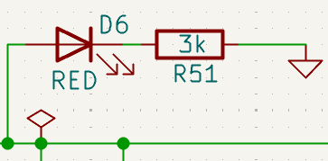
I've also added LEDs like this to indicate the activity of several power lines: red for 24V, yellow for both VBUS and 5V (two LEDs indicating the same nominal power level of ~5V), and yellow-green for 3.3V.
I will now be working on the Motor Drivers.

**Total time spent: 3 hours**

# 2026-06-23: Stage 1 — Custom STM32F446-Based Motor Controller (Dev Board) - DEVLOG7 - MOTOR DRIVERS

I will be using 6 motors: 3 NEMA 17s and 3 NEMA 23s. The reasoning behind this distribution is that the NEMA 23s are placed at the base, shoulder, and elbow. The arm has six degrees of freedom, starting from the bottom: base, shoulder, elbow, roll, pitch, yaw. The base, shoulder, and elbow are the joints requiring the most load-bearing capacity, with the shoulder under the most load overall. To control these motors, I'm using [TMC2209](https://global.bttwiki.com/TMC2209.html) drivers for the NEMA 17s and [TMC5160](https://global.bttwiki.com/TMC5160T%20Pro%20V1.0.html) drivers for the NEMA 23s. Since we're only controlling NEMA motors, we could technically use either driver for either motor, but the TMC2209 is widely considered the best purpose-built driver for NEMA 17s, with the TMC5160 being overkill for that role. Similarly, for the NEMA 23s, the TMC5160 is generally considered the better overall pick.
So that's 3 TMC2209s and 3 TMC5160s.
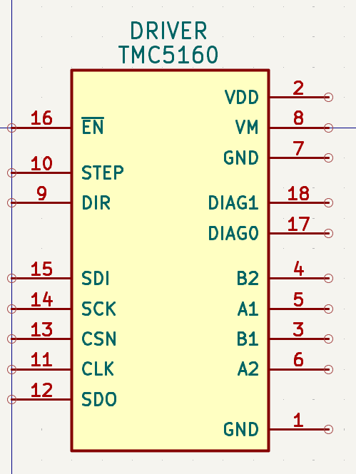
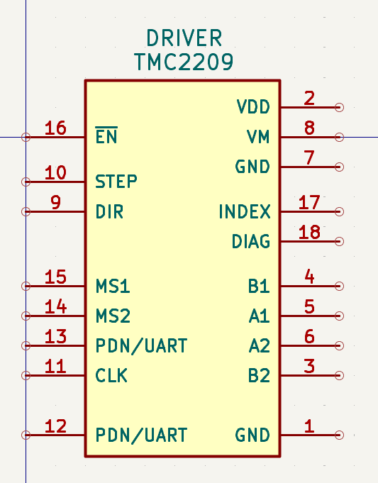
These are the symbols I've used for these drivers. Since they're off-the-shelf modules, the footprint is basically just holes for female 2.54mm pitch pin headers.
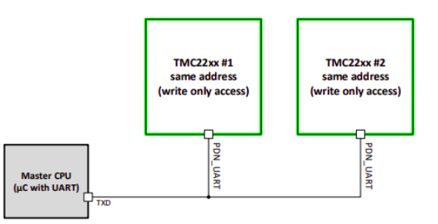
A bit on how these drivers function: the TMC2209 uses UART to communicate with the MCU. Since the motor driver is primarily meant to receive commands, I'm using the single-wire (half-duplex) UART mode, connecting only the line needed to transmit commands. An interesting feature of these drivers is that up to four of them can share a single UART line. The MS1 and MS2 pins act as address pins, and setting them high or low in different combinations assigns each driver a UART address. The address is set as a two-bit value, with MS2 as the high bit and MS1 as the low bit.
If both pins are grounded, both bits are 0, giving address 00.
If MS1 is tied to VCC and MS2 is grounded, MS1 reads 1 and MS2 reads 0, giving address 01.
The remaining two combinations give addresses 10 and 11, allowing up to four drivers on a single UART line. Since I'm only using 3 drivers, a single half-duplex UART line is sufficient. A couple of other things worth mentioning: the DIAG pin, common to both driver types, is a diagnostics pin that signals the MCU if something is wrong. This needs to be wired to a GPIO if it's going to be used, and due to a tight pin budget, I'm only connecting the DIAG pin on the TMC5160 drivers, the ones for the base, shoulder, and elbow, since these are the joints carrying the most load. The other main shared pins are EN, STEP, and DIR.
EN is the enable pin, essentially the on/off switch for the driver. STEP is the pulse input, where a single pulse moves the motor one step forward. DIR is the direction pin, and setting it HIGH or LOW determines whether the motor spins clockwise or counterclockwise.
The TMC5160 uses SPI, with four pins for communication that give access to the drivers' smart features and allow software control. These four pins are MOSI, MISO, CSN, and SCK. Connecting the motors to the drivers is its own task, since the motors have four-wire, non-center-tapped inputs corresponding to the two internal coils. I've added JST-VH connectors directly on the main board so the motors can plug straight in.
I've also added decoupling capacitors on the VMOT line, the driver's 24V input, along with 33 ohm resistors on the STEP and DIR lines of each driver and on the CSN line of the TMC5160s, just to limit current. The DIAG pins on the TMC5160s require an external pull-up, which has also been added.
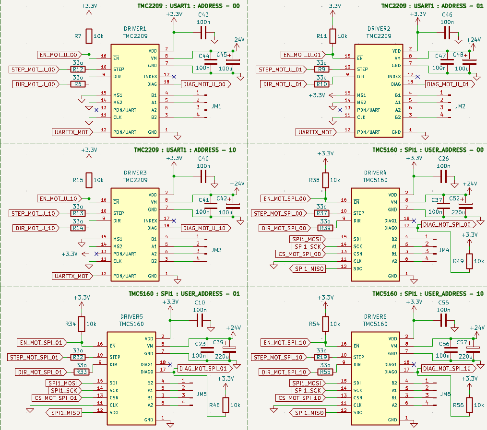
This is the finished motor driver circuit. Next I'll be wiring up the encoders.
PS: I've been using global labels to keep the overall circuit neat and easy to read.

**Total time spent: 6 hours**

# 2026-06-23: Stage 1 — Custom STM32F446-Based Motor Controller (Dev Board) - DEVLOG8 - MAGNETIC ENCODERS

I am using [MT6835](https://robu.in/product/mt6835-magnetic-encoder-module-pwm-spi/) magnetic encoders for the arm.
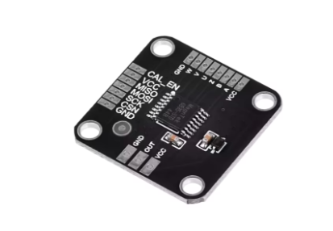
Magnetic encoders are essentially smart direction detectors: all they do is measure the change in direction of a magnetic field. A diametric magnet, meaning a magnet with opposite poles across a diameter, is placed coplanar above the chip, leaving just a tiny gap of about 1mm.
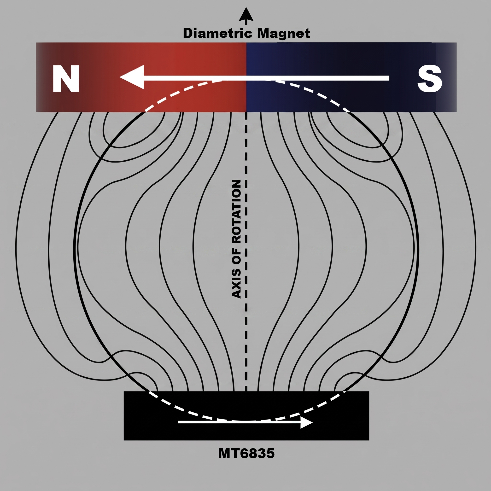
The chip detects changes in the direction of the magnetic field produced by the magnet above it. The higher the resolution, the smaller the change in angle it can detect. A 21-bit encoder like this gives an angular precision of about 0.0001717 degrees.
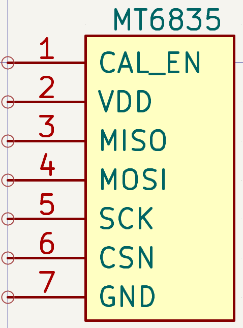
The MT6835 uses normal 4 pin SPI to communicate with the board. It has a CAL_EN pin, the calibration enable pin, which triggers auto-calibration mode when pulled high. Since I'm using SPI, I can trigger calibration through software instead, so grounding this pin is the right choice. All six encoders, one for each joint, are connected to the same SPI bus.
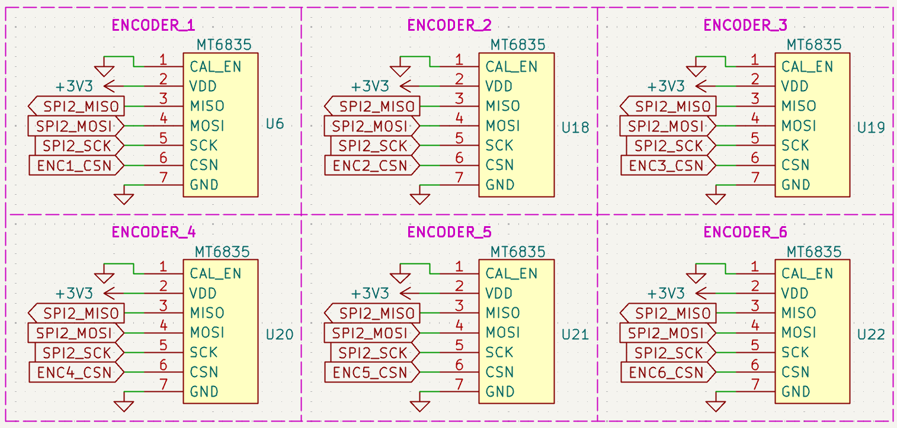
The encoders will be placed in front of the gearboxes I'll be using on the NEMA motors, since the gearbox output will be the actual driving force being measured.

**Total time spent: 1 hour**