# Voxboard

A custom 4-layer motor controller board for a 6-DOF robotic arm, built around an STM32F446RET6. It drives six stepper motors with closed-loop magnetic encoder feedback, talks to a Raspberry Pi for inverse kinematics, and exposes CAN, I2C, and USB for future expansion.

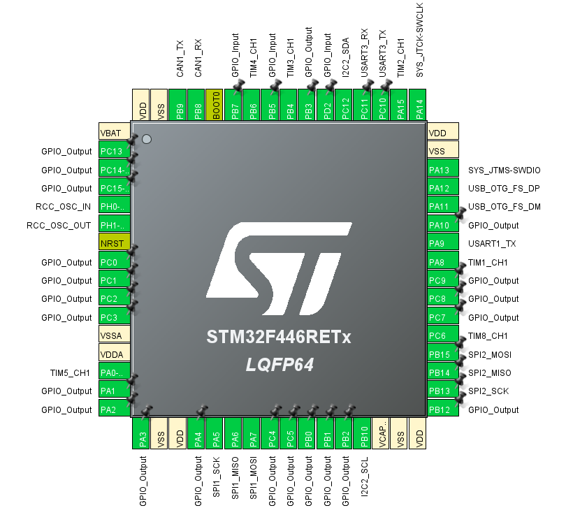

---

## Core MCU

- STM32F446RET6, Cortex-M4 running at 180MHz off an 8MHz crystal
- Standard ST decoupling scheme on VDD/VBAT and VDDA, per-pin 100nF caps plus bulk capacitors
- NRST push button (internal pull-up, no external needed) and a BOOT0 slide switch
- 5-pin SWD header for programming via ST-Link
- Heartbeat LED for status indication

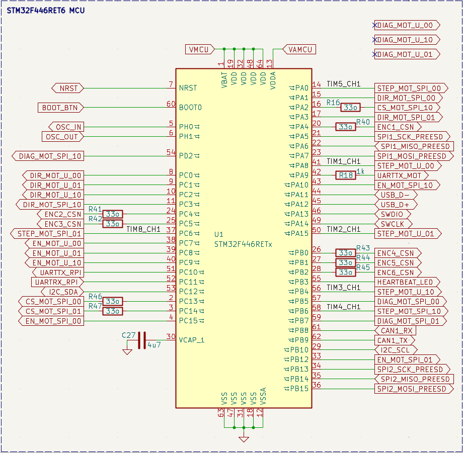

---

## Power

24V enters through an XT60 connector and feeds a back-EMF and filtering network before splitting off to the motors directly. A buck converter (TPS54331) steps 24V down to 5V, feeding an LDO that regulates the final 3.3V logic rail. Running two stages instead of a single 24V-to-3.3V converter keeps the logic rail clean and low-noise.

A P-MOSFET and Schottky diode pair handles priority between the buck output and USB VBUS, so the board always runs off the battery when it's present and only falls back to USB power for programming when it isn't.

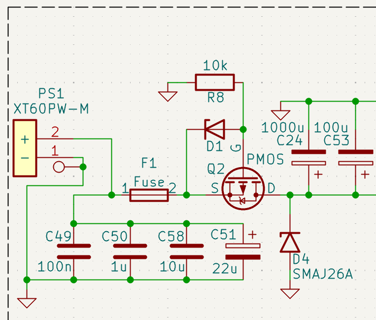

Status LEDs indicate activity on each rail: red for 24V, yellow for VBUS/5V, yellow-green for 3.3V.

---

## Motor drivers

Six motors in total: three NEMA17s (roll, pitch, yaw) driven by TMC2209s over single-wire half-duplex UART, and three NEMA23s (base, shoulder, elbow) driven by TMC5160s over a shared SPI bus. The NEMA23s sit at the joints carrying the highest load.

Each TMC2209 gets an address set through its MS1/MS2 pins, allowing multiple drivers to share one UART line. STEP, DIR, and EN are wired per driver, with series resistors for current limiting. DIAG is only connected on the TMC5160s, since those joints need it most and GPIO budget is tight.

Motors connect through JST-XH connectors mounted directly on the board.

---

## Encoders

Six MT6835 magnetic encoders, one per joint, provide absolute position feedback at the gearbox output shaft. They share a single SPI bus. CAL_EN is tied to ground since calibration is triggered through software instead.

---

## CAN bus

An SN65HVD230DR transceiver gives the board a CAN interface, mainly intended for connecting an end-effector controller later on. Includes end-termination and ESD protection placed right at the connector.

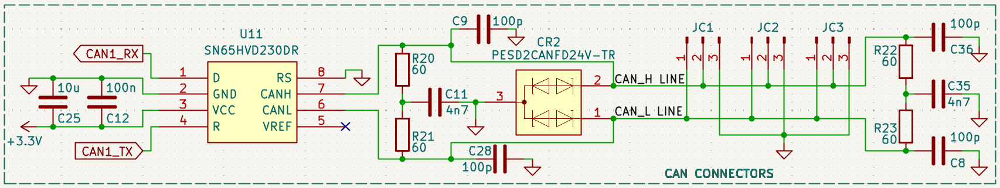

---

## I2C

A couple of JST-GH connectors broken out for I2C, left open for future sensors. Same ESD protection approach as the rest of the board's external connectors.

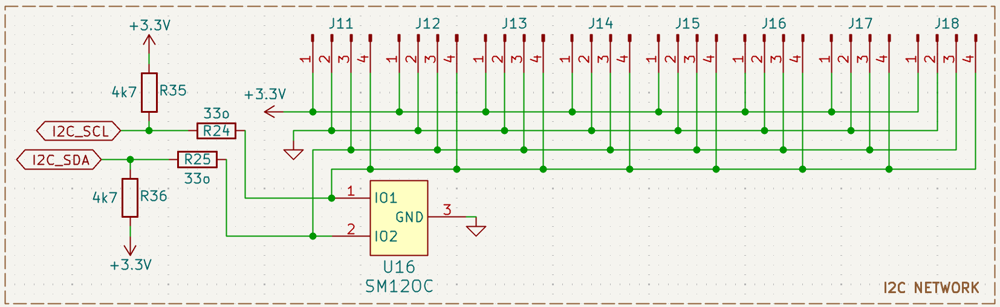

---

## USB

A USB-C 2.0 connector with ESD protection on the D+/D- lines, used purely for programming and debug, not for powering the whole system under normal operation.

---

## ESD protection

Connectors that reach off-board (USB-C, CAN, RPi UART, I2C) get ESD protection right at the connector, stopping any transient before it reaches the rest of the circuit. Buses that stay entirely on-board (encoder SPI, driver SPI, TMC2209 UART) get their ESD protection near the MCU instead, guarding the chip pins directly.

---

## Layout and routing

4-layer stackup: signal, ground, 3.3V power, signal. The ground plane is a single unified pour, motors and logic share it, with noise managed through tight decoupling and via stitching rather than a split plane.

High-current traces run as fill zones rather than individually routed tracks, since a shaped pour handles current distribution far more cleanly for the 24V rail. All vias are standard through-hole, 0.4/0.3mm, chosen as JLCPCB's smallest reliably manufacturable size.

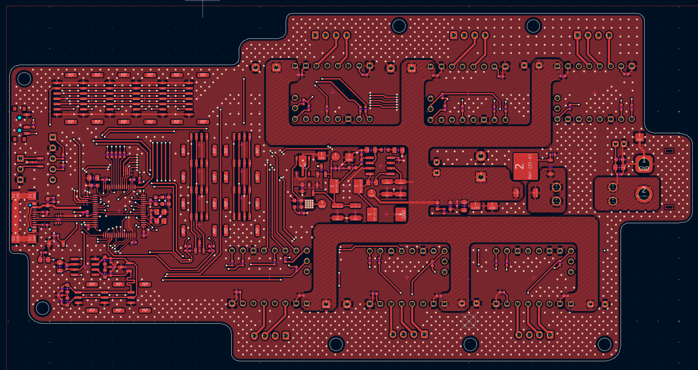
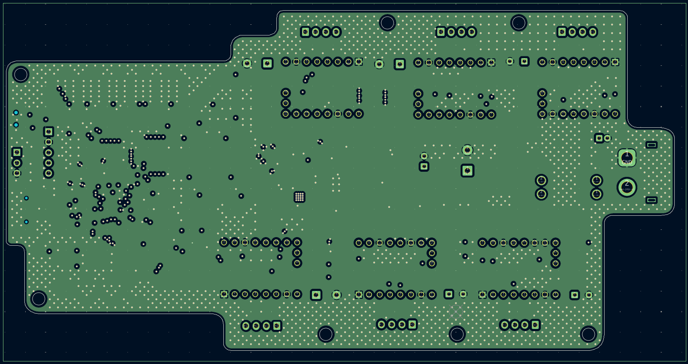
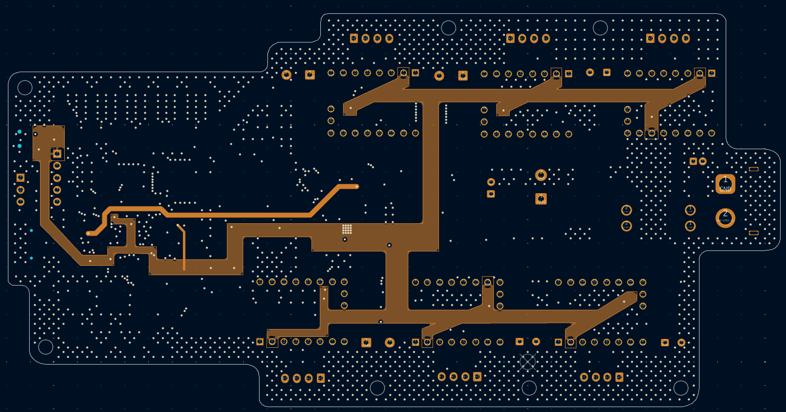
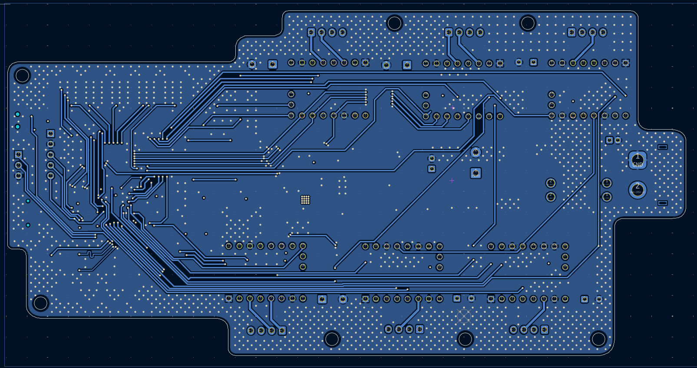
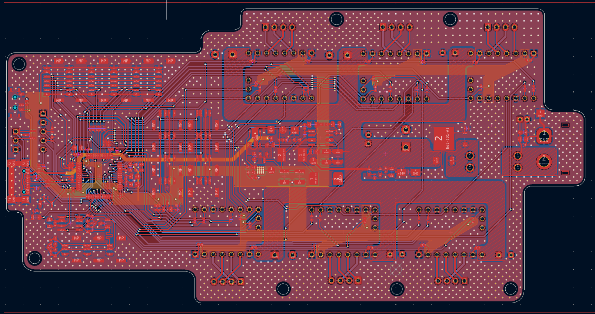

Ground stitching vias run alongside every high-speed signal via to keep return paths short and reduce EMI.

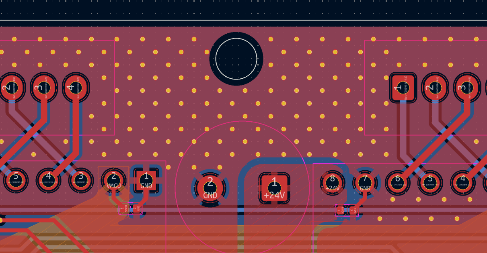

---

## Final board

Custom 3D models were made in Fusion 360 for parts without existing KiCad models, including the main inductor and the motor driver modules. Silkscreen on the back carries a short board description, designer credit, and a small logo.

---

## BOM

Parts list exported from KiCad and matched to JLCPCB part numbers. Total parts cost as of October 2026: **$263.61 for 2 PCBAs** (excludes PCB fabrication and assembly charges). Full BOM and schematic files live in [`/Stage1 - STM`](https://github.com/shadedvox/arsenal/tree/main/Stage1%20-%20STM).